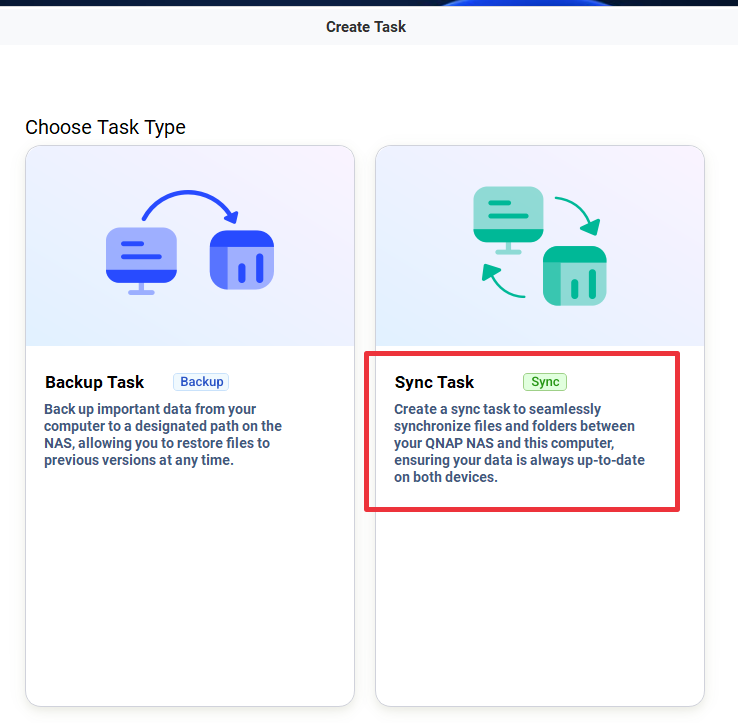
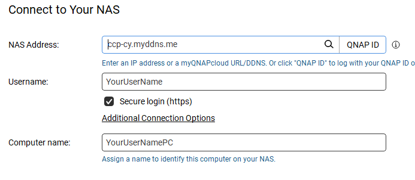
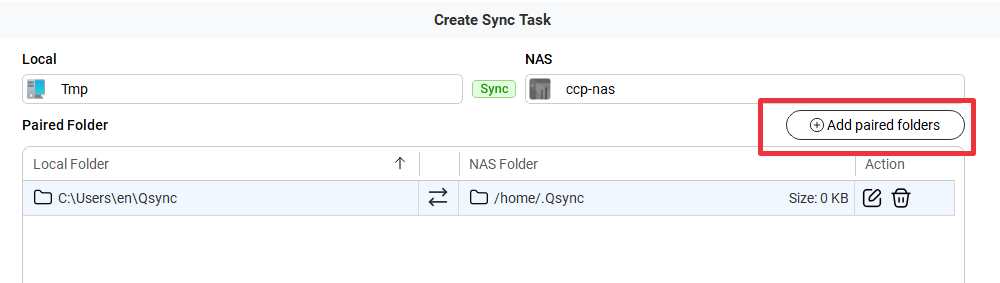
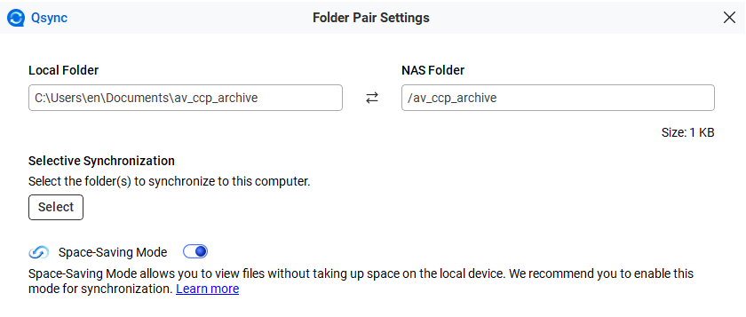
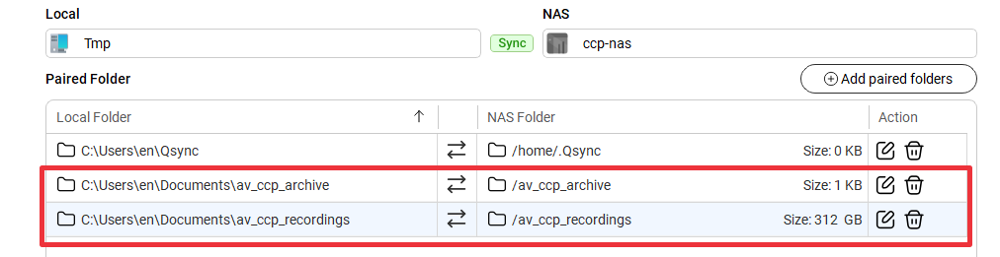

<h1>Downloading assets</h1>

<!-- TOC -->
* [Accessing the NAS](#accessing-the-nas)
  * [QSYNC](#qsync)
* [How to know if you have anything to do?](#how-to-know-if-you-have-anything-to-do)
* [About the files](#about-the-files)
  * [Recordings](#recordings)
  * [The PROGRAM recording](#the-program-recording)
  * [The ISO recordings](#the-iso-recordings)
    * [Originals](#originals)
    * [The _converted.mp4-s](#the-_convertedmp4-s)
    * [More files](#more-files)
* [Archive](#archive)
* [Thumbnails](#thumbnails)
<!-- TOC -->

# Accessing the NAS

Please note, that most of this is under development, and is subject to change, but this document reveals the current state.

The nas can be found here: https://ccp-cy.myddns.me/cgi-bin/
 * Log in
 * Open File Station
 * Navigate to Data/av_ccp_recordings or
 * Navigate to Data/av_ccp_archive
   * (Quick tip: right click on these and "Add to favorites" for easier access next time)

From here you can download files, maybe downloading one by one is recommended, otherwise it ZIPs the files.

## QSYNC
You might set up the QSYNC desktop app for synchronization:

 1. Download from https://www.qnap.com/en/utilities/essentials#utliity_3
 2. Install it next next next...
 3. Create SYNC Task

 4. NAS ADDRESS:
    * ccp-cy.myddns.me (no https:// in the beginning, no / at the end, just that)

 5. Folder setup:

 

Set up all shared folders you got:

 

# How to know if you have anything to do?

If there are any new recordings in the av_ccp_recordings folder, then you can work with them. Check the church's schedule to know when things happen.

Currently, the regular events are as follows:
 * Sunday services
 * Tuesday, Thursday bible-school

# About the files
## Recordings
The recordings are automatically uploaded to here into a folder with a date:

## The PROGRAM recording

Inside each folder there are one or more .mp4-s, these are the "PROGRAM recordings".
The program recording is the original version of almost the same thing as we streamed:

If the event had a break in it, then you'll see the file indexed as :
* "*** 01.mp4"
* "*** 02.mp4"
* etc.

In this case there was one break, so the part before the break is "01.mp4" the part after is "02.mp4".
You can simply load both files up in [losslesscut](video_editing.md) and create one output out of them.

## The ISO recordings
Our new device records all of its inputs separately as well, if you are interested in any of that, here is how to navigate amongs them.

Go into the "Video ISO Files" folder inside of the recording folder, and you'll see many files.

Let's start with the simplest possible:

### Originals
The original files are named according to this schema:

**[recording name]**_**[date]** **[CAMERA INDEX]** **[RECORDING INDEX]**.mp4

* Recording name: For our church recordings it is usually CCP
* Date: the date of the recording
* Camera index:
  * 1: Our main camera
  * 2: The input from the projection PC
  * 3: The input from the pulpit PC
  * 6: The input from the audio video booth PC
* Recording index: If the recording had a break in it, then it is incremented by 1. 

So on the above picture we have 3 recordings from the same event, starting from the same moment and being the same length, but
without any cuts. The **CAM 1** is probably the most interesting for most editors, that is the full unedited 1-1 recording of the camera.

### The _converted.mp4-s
Now, our device records in a very high quality, and there is no way to change that.

Because of that our server automatically down-scales these files, and those are the ones with the _converted.mp4-s.

There is no visual quality difference between the two versions, but the _converted one is usually 10 times smaller, so
we recommend using those for any purpose.

The _converted.mp4-s might not be there immediately, currently the server processes them after midnight, so by next day they will be there if all goes well.

### More files
Here is a more convoluted possibility:

This is an example of an event that had a break in it, therefore each CAM * has two originals.
 * The green ones are from before the break (01.mp4)
 * The blue ones are from after the break (02.mp4)

Please note:
 * The blue ones have no _converted.mp4-s yet, as the server did not get there yet
 * There is a ***_converting.tmp.mp4, do not use that, that is being converted right now, wait until it gets renamed to _converted.mp4
   (Don't actually wait, rather go to sleep, because as of now it is generated very slowly, it's an overnight process for processing all videos in a recording folder.)

# Archive

When you are finished with your edit, please put it into the archive folder under the current year.

Please use the "YYYYMMDD \$EVENT \$TITLE \$SPEAKER.mp4" template for file naming, e.g.:
 * "20260210 - Mathitís - The Acts of the Apostles - Chapter 3 & 4 - Pastor Tim Mattox"
 * "20260210 - Who are we in Christ - Book 3:2 - Pastor Some Body"

# Thumbnails

You can find thumbnails in the [Thumbnails](https://drive.google.com/drive/folders/1G_yGUalItjvr9RIatlAt7c1_WIkqtqAj?usp=sharing) folder.

