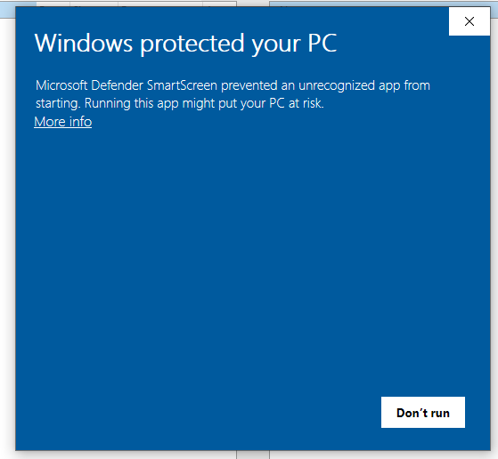
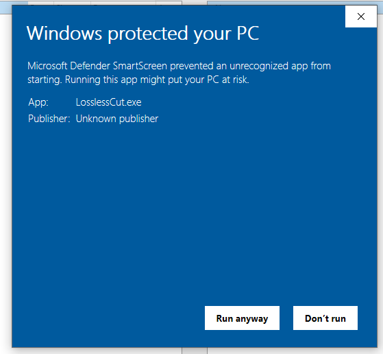

<h1>Installing LosslessCut</h1>

The advantage of this tool is:
* It is very simple to use.
* It can cut videos without re-encoding them (without loosing quality)
* It is very, very, very fast.

# 1) Download

[Download](https://github.com/mifi/lossless-cut/releases) the tool.

* Select the latest release, scroll down to "Assets".
* You might need to press on "show all assets"
* For windows, download: LosslessCut-win-x64.7z

# 2) Extract

If you are on windows and downloaded the 7z file, you need to extract it.

If you need tips on that, then I'd recommend [WinRar](https://www.win-rar.com).
 * Install WinRar
 * Open the file browser in Downloads
 * Right-click on the LosslessCut file
 * Select "Extract to 'LosslessCut-win-x64'"

There is no installer, you just start it from this folder, therefore you might want to move the 'LosslessCut-win-x64' folder
to some more sensible place than the downloads. Just remember where you put it:)

# 3) Start

 * Open the 'LosslessCut-win-x64' folder, and double click "LosslessCut.exe".
 * For the first time, windows might try to protect you:
    
 * Press on "More info"
    
 * Press "Run anyway"

----

Go back to [video editing](video_editing.md).
