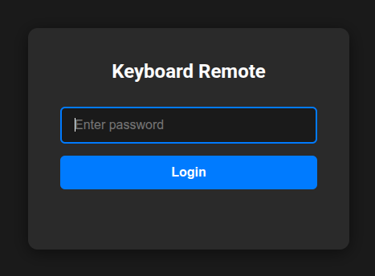
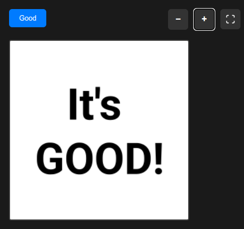

# The It's Good button

1. Connect to the **Staff WiFi** network (it only works from this network!)
2. Open this address: [https://192.168.2.10/remote](https://192.168.2.10/remote/)
3. Get through the warning "**This Connection Is Not Private**":
   * Click on "**Show details**" or "Advanced" or "More" 
   * Click on "**Accept**" or "Proceed to ..." or similar.

4. You should get to this:

   

5. Ask the password from the media team leader, or the one showing you this:)

## Using it

Well, if you hear something good, push the button:)

This website will try to keep your phone's display light constantly on, to prevent the lockscreen coming in.
So you can lower the brightness of your screen and put it next to you, so you can just conveniently touch the button whenever you want.

### What happens when you push it?
If a recording is active, the timestamp will be recorded at the moment of pushing the button. (Please note, on sundays we won't record the first service.)

 Later on after the video processing is done (usually a full night), you'll see the files appear in
 `<SESSION FOLDER>/Video ISO Files/shorts/`

And in this, you'll see files, named like this:

`CCP_20260315_1000 CAM 1 01 id19 in4106 out4706.mp4`

> The part where the button was pressed is exactly in the **middle of each file**, so the context can be trimmed easily.

If you want to search this part in the original full recording, then the file name can help you:

* `CCP_20260315_1000 CAM 1 01 id19 in4106 out4706.mp4` breaks down to:
   * `CCP_20260315_1000 CAM 1 01(_converted.mp4)`: the source recording
   * `id19`: Just an internal id of the record for this sort
   * `in4106`: 4106 is the seconds where this exact video starts in the source
   * `out4706`: 4706 is the seconds where this exact video ends in the source