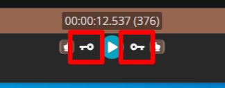
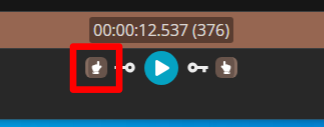
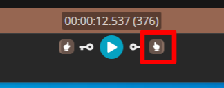
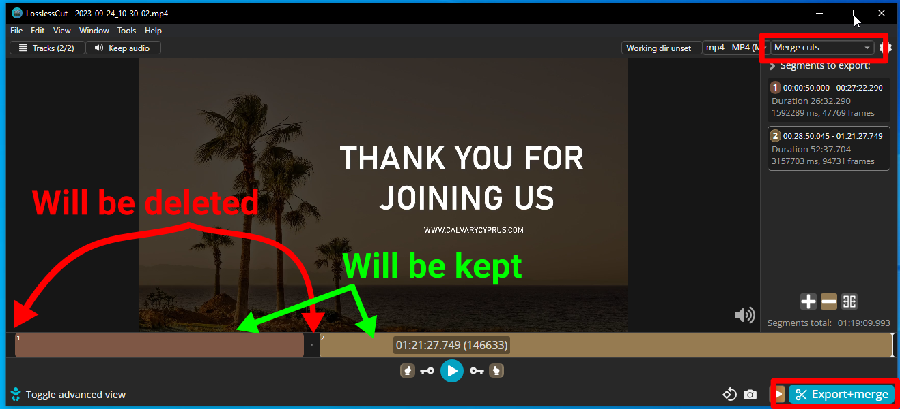
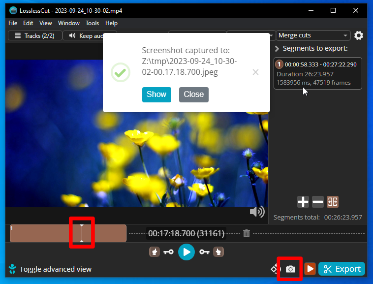

<h1>Video Editing</h1>

<!-- TOC -->
* [Video tutorial](#video-tutorial)
* [1) Concatenate if needed](#1-concatenate-if-needed)
* [2) Trim and cut as needed](#2-trim-and-cut-as-needed)
  * [Cut points to be aware:](#cut-points-to-be-aware)
  * [Trimming, cutting](#trimming-cutting)
* [3) Exporting a frame for thumbnail](#3-exporting-a-frame-for-thumbnail)
<!-- TOC -->

# Video tutorial

You can check out parts of this guide as a [video tutorial](https://youtu.be/XMtl2iVmafg) also. 
Still you want to read the guide also, the video is just a companion guide.

# 1) Concatenate if needed

Concatenation is a serious sickness, that happens to video files. Just kidding.
So that is when you join multiple videos together.
Sometimes, technical issues might break up the recording into multiple parts. That's when you need to combine them first.

Use the free, open-source tool called [LosslessCut](https://github.com/mifi/lossless-cut/releases), to edit the video.
Learn how to install LosslessCut [here.](installing_losslesscut.md)

1. Start [LosslessCut](installing_losslesscut.md)
2. File -> Open
3. Select the video files
4. Tools -> Merge/Concatenate video files
5. Press [MERGE]

The video is saved next to the input videos, and in this case, you want to use that in the next steps, instead of the
separate parts.

# 2) Trim and cut as needed

## Cut points to be aware:

* Beginning: Before the person doing the announcements just about to start to speak.
    * Sometimes they are testing audio, or just chatting you want to check and cut that.
* Breaks: Bible-school classes usually have a long break in the middle.
    * Check beginning/end of breaks for real content.
* End: After the "Thank you for joining us" end screen, or after the blessing prayer from 2. Cor 13:14.

## Trimming, cutting

1. Start [LosslessCut](installing_losslesscut.md)
2. File -> Open
3. Select the video file
4. Mark regions (you want to KEEP not those you want to delete!):
    * Mark IN point
        * Move the play-head to the position where you want the IN point to be.
        * Fine-tune the alignment with the keyframe buttons.
            * 
        * Mark the beginning by pressing the "Start current segment" button.
            * 

    * Mark OUT point
        * Move the play head to the position where you want the OUT point to be.
        * Fine-tune the alignment with the keyframe buttons.
            * 
        * Mark the end by pressing the "End current segment" button.
            *  

   You can have multiple regions, if you want to cut something out, but most of the time we only trim the beginning and
   the
   end.

   You should reach something like this (regions you are KEEPING are displayed with a brownish bar, the black one with are TRASH icon will be deleted:

    

5. Make sure, that the top right selection is "Merge cuts" (or "Separate files" if you only have a single segment).
6. Press the "Export+Merge" button.

The file will be saved next to where you have downloaded the video.

# 3) Exporting a frame for thumbnail

If you need/want to make a thumbnail out of a frame in the video, follow these steps.

* Move the play-head to the frame you want to export
* Press the little camera icon in the bottom right corner

The file will be saved next to where you have downloaded the video.
