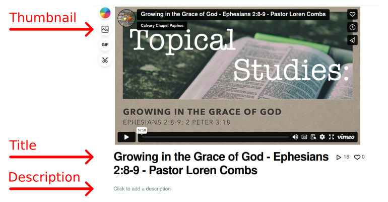

<h1>Managing Vimeo</h1>

# Upload the video

Upload the video to our [vimeo page](https://vimeo.com/user133790558).

# Set video details

Please follow the guidelines in [video metadata templates](video_metadata_templates.md).

# Add it to the proper playlist

Playlists are called showcase in vimeo.

And you can edit them under the [Showcases](https://vimeo.com/manage/showcases) admin panel menu.

* Sunday messages go to "Sunday Messages"
* Mathitís classes go to their respective playlists and to "Mathitís - School of Discipleship"

# Publish from Vimeo to YouTube and Facebook

* Go to the [Library](https://vimeo.com/manage/videos) of videos
* On the right column there is a "publish to social" option if you move your mouse there.

* Select the proper platforms (YouTube and Facebook)
* And push through the steps.

# Fix missing info
 - Vimeo does not appear to set thumbnails on the pushed videos, you need to set those manually.
 - On YouTube you need to add the video to the [proper playlist](youtube.md#add-it-to-the-proper-playlist), make the live unlisted, etc. (Check all the steps in the [youtube](youtube.md) guide.)
 - On facebook you need to  make the live unlisted, and check for other potential steps in the [facebook](facebook_video.md) guide.