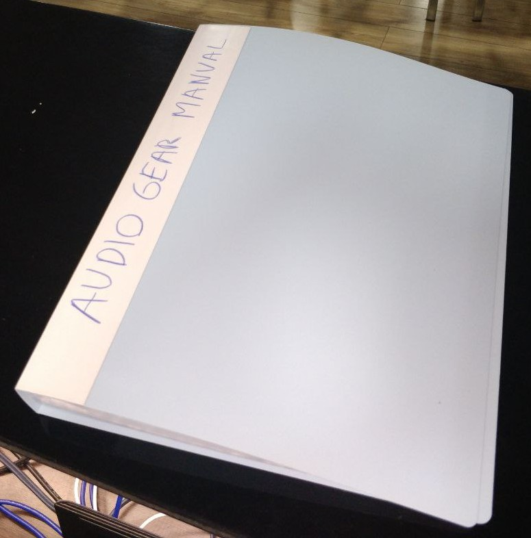

<h1>For technicians</h1>

## Church audio system related custom documentation and guides

### Audio

These are printed out and organized into a folder, that you can find next
to the console.

* Setting up the system: [WEB](settingup.md), [PDF](settingup.pdf)
* What to do during a rehearsal: [WEB](rehearsal.md), [PDF](rehearsal.pdf).
* What to do during a service: [WEB](service.md), [PDF](service.pdf).
* Notes on the console: [WEB](notes_on_the_console.md), [PDF](notes_on_the_console.pdf).

 

### Live-streaming & video

* Handling live streaming: [WEB](video.md), [PDF](video.pdf).
* Doing A/V for bibleschool: [WEB](other_guides/bibleschool_av.md), [PDF](other_guides/bibleschool_av.pdf).

### Training videos

* [How does the stage mixer work?](https://youtu.be/nRDQFHH9zpU)
* [How does the drum room stage-talkback work?](https://youtu.be/nelw-jKgT6w)
* [Audio Training: Overview of the audio system and the console](https://youtube.com/watch?v=Z1rGS40XmTA)
* [Audio training: Rehearsal walkthrough with the console](https://youtu.be/CDxC-ptjJwU)

### Resources

Our console is called "[Behringer X32 Compact](https://www.behringer.com/product.html?modelCode=P0AAP)"

* [Behringer X32 compact block diagram](assets/x32/blockdiagram.png)
* [Behringer X32 compact user manual](https://mediadl.musictribe.com/media/sys_master/h1f/h56/8849797021726.pdf)
* [Our mixer's complete backup files](assets/console/files/mixer_backups)

* Configuration reference [WEB](configuration_reference.md), [PDF](configuration_reference.pdf).

## Great resources to learn from

* Drew Brashler's awesome tutorials on our mixer https://youtube.com/@DrewBrashler/videos
    * Personally I've learnt a lot from him, totally recommend.
    * [X32 Basic mixing playlist](https://www.youtube.com/watch?v=pmMGCYIoxzA&list=PLZNYaC2mTs0h-Y2sWMvVP4GftI-ORt-9T)

* AudioUniversity: https://youtube.com/@AudioUniversity/videos
* Attaway Audio: https://youtube.com/@AttawayAudio/videos
* Mix with the masters: https://youtube.com/@mixwiththemasters/videos

## Cable & microphone numbering on the stage

The logic is, that:

* Close to **Mic1** is now **Inst1** and **Inst2** cables.
* Close to **Mic3** is the **Inst3** cable.
* And the stage corner has **Inst4** and **Inst5** cables.

# General notes for technicians

## Please never share the WiFi password with anyone
Our internal systems for streaming, audio, etc. are using the network, and we don't want any interruption in our network.

Often people ask for the password, feel free to give the above explanation.
If the reason is to be able to read the bible, we have bibles in many languages, point them 
to those on the shelves.

