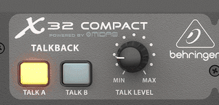
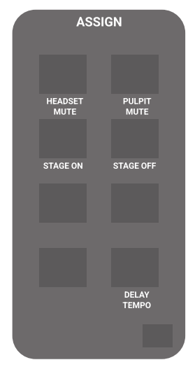
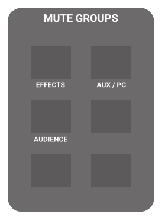
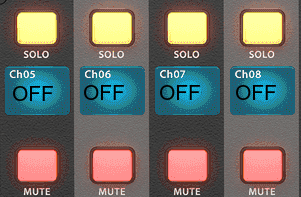

<h1>NOTES ON THE CONSOLE</h1>

<!-- TOC -->
* [Talkback](#talkback)
* [Tips and tricks](#tips-and-tricks)
  * [Never "select" the group channels](#never-select-the-group-channels)
  * [Shortcuts for muting various things](#shortcuts-for-muting-various-things)
    * [Muting preacher microphones](#muting-preacher-microphones)
    * [Muting the stage](#muting-the-stage)
    * [Muting the effects](#muting-the-effects)
    * [Muting the aux / pc](#muting-the-aux--pc)
  * [Playing background music](#playing-background-music)
* [Connecting with applications](#connecting-with-applications)
  * [X32 EDIT](#x32-edit)
  * [Android](#android)
* [Other applications that might come handy](#other-applications-that-might-come-handy)
  * [Android](#android-1)
    * [Spectrum analyzer](#spectrum-analyzer)
    * [Instrument tuner aid](#instrument-tuner-aid)
<!-- TOC -->

# Talkback

 * You can speak to the stage while holding the "**TALK A**" button.
 * Use "**TALK B**" if you want to talk to the stage AND the house too.
   * A memory device to remember which is which: you mostly want to talk to the stage only, and that is the most easily accessible button in the top left corner on the console.
 * Use the "**Talk level**" knob to set your volume.
 * The microphone is at the left bottom corner of the screen.
 

# Tips and tricks
## Never "select" the group channels

On the right half of the console, the first layer is the Groups/DCAs, that remote control other channels.
Never press the "select" on those.

The result of selecting those are not intuitive, and the chances of messing up something by accident is very high.

## Shortcuts for muting various things
On the bottom-right side of the mixer, you'll find these two sections:

 

### Muting preacher microphones

Because during a service it might often (and sometimes suddenly) changed which microphone is used (pulpit, or the headset), there are two buttons that are always on hand, to mute/unmute them.

Check the "Assign" section above for "HEADSET MUTE" and "PULPIT MUTE".

Pressing them will make them lit, if they are lit, the channel is MUTED.
Pressing them is exactly the same thing as pressing the MUTE button on the respective channels on the "Speaker" layer.

### Muting the stage

It is very important, to be able to quickly turn on/off the stage, because: 

 * The microphones might feed back during preaching.
 * The musicians sometimes unplug/plug instruments.
 * People on the stage sometimes accidentally hit microphones.

Please remember:

 * During preaching, the stage must be off.
 * During worship, the preacher mics should be off.

Check the "Assign" section above for "STAGE ON" and "STAGE OFF".
Sadly it's not a single toggle button, and the buttons are not lit in any case.
The way to know if the stage is off is the following:

 * If you remember, that you pressed "stage off". :)
 * If the channel strip's displays showing "OFF" in the second row.
 * If there is no signal indication on any stage inputs.
 * If everyone is looking at you, expecting the stage to work. :)

 

The stage off/on does not affect anything important, every level, channel name, eq, mute status etc. is retained.

The stage off function does not affect the keyboard, as it is rarely messed with. It is not a source of feedback, and sometimes during the end of the preaching someone might start to play on it. 

By never disabling it, we don't need to keep an eye on it either, it just works always.

### Muting the effects

All vocal effects can be disabled by the "EFFECTS" button on the "Mute groups" section (see above). If it is LIT, then it is MUTED.

We need to watch out during worship, to disable the vocal effects during them preaching/praying. Having echo/reverb on a prayer is very, very, very cheesy, so please pay attention to it.

If you think it's too much to look after, then just mute the effects and forget it. It's better not to have effects, than to have them when someone prays:)

### Muting the aux / pc

All aux inputs can be muted with the  "AUX / PC" button on the "Mute groups" section (see above). If it is LIT, then it is MUTED.

This button mutes all inputs from the streaming pc and the projection pc leads. It's best to have them muted all the time, except when you want to play something from any of those computers/leads. 

Especially have them muted before you unplug/plug it in into something.

## Playing background music

There is an extra 3.5mm trs jack lead dangling around the projection machine, you might connect some device to it to play back music.

You might also play back music from the streaming pc.

 * Unmute the "AUX / PC group" (see previous paragraphs)
 * Go to the "AUX IN 1-6, USB REC" layer (on the left side)
 * Adjust the volume of the appropriate input (you see on the indicators which one has signal)

# Connecting with applications

It is possible to connect to the console remotely with an application, and basically do everything you might while standing next to the console. What a world we live in!

It is not required, but it can come handy sometimes when you are on the stage for example, 
these apps can spare some kilometers of running back and forth.

Also, if you want to do the mixing outside the cave, you can use a tablet/pc or whatever.
Although, I recommend doing that only after you are really confident with the mixer and the system. Because these applications are a bit harder to use, less user-friendly/intuitive. If some random issue pops up, you might be able to fix it better/faster/easier if you are next to the console, than turning pages and swiping back and forth, etc.

## X32 EDIT

If you have any kind of computer, and you are connected to the network, you can install X32 edit. Check the downloads section [here](https://www.behringer.com/product.html?modelCode=P0AAP).

## Android

I had much success with the app called [Mixing station (org.devcore.mixingstation)](https://play.google.com/store/apps/details?id=org.devcore.mixingstation).

You might want to download [my settings backup](assets/console/files/android_mixingstation_settings_backup.msz), and load it into the app, to help you started quicker.

# Other applications that might come handy
## Android
### Spectrum analyzer
[https://play.google.com/store/apps/details?id=org.intoorbit.spectrum](https://play.google.com/store/apps/details?id=org.intoorbit.spectrum)

### Instrument tuner aid
[https://play.google.com/store/apps/details?id=de.moekadu.tuner](https://play.google.com/store/apps/details?id=de.moekadu.tuner)

