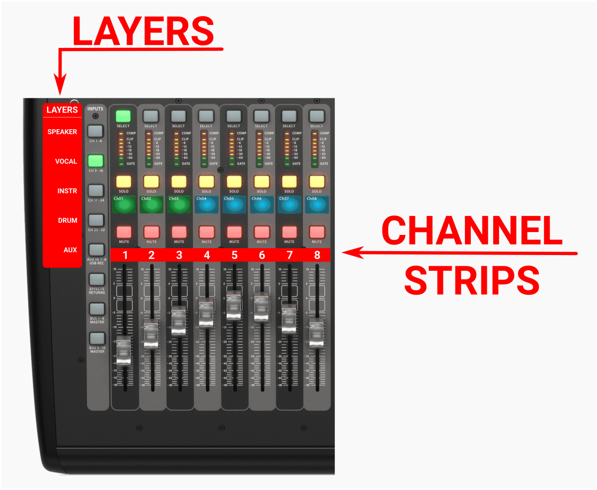

<h1>NOTES ON THE CONSOLE</h1>

----

<h2>Table of contents</h2>

<!-- TOC -->
* [Reference on stage channel names](#reference-on-stage-channel-names)
* [LAYERS, CHANNELS!](#layers-channels)
* [Signal flow](#signal-flow)
* [Notes on groups](#notes-on-groups)
  * [Speaker](#speaker)
  * [Vocals](#vocals)
  * [Instr 1, 2](#instr-1-2)
  * [Instr 3, 4, 5](#instr-3-4-5)
  * [Keyboard](#keyboard)
  * [Drums](#drums)
  * [Aux / PC](#aux--pc)
  * [FX](#fx)
* [Listening in (using the headphones, SOLO)](#listening-in-using-the-headphones-solo)
  * [Press the Solo Clear](#press-the-solo-clear)
  * [Press the SOLO button(s)](#press-the-solo-buttons)
  * [Adjust volume](#adjust-volume)
* [Talkback](#talkback)
* [Tips and tricks](#tips-and-tricks)
  * [Never "select" the group channels](#never-select-the-group-channels)
  * [Shortcuts for muting various things](#shortcuts-for-muting-various-things)
    * [Muting preacher microphones](#muting-preacher-microphones)
    * [Muting the stage](#muting-the-stage)
    * [Muting the effects](#muting-the-effects)
    * [Muting the aux / pc](#muting-the-aux--pc)
* [Remote controlling the console](#remote-controlling-the-console)
  * [From PC: X32 EDIT](#from-pc-x32-edit)
  * [From Android: Mixing station](#from-android-mixing-station)
* [Remote control OBS: OBS Blade](#remote-control-obs-obs-blade)
* [Other applications that might come handy](#other-applications-that-might-come-handy)
  * [Android](#android)
    * [Spectrum analyzer](#spectrum-analyzer)
    * [Instrument tuner aid](#instrument-tuner-aid)
<!-- TOC -->

# Reference on stage channel names

The logic is, that:

* Close to **Mic1** is the **Inst1** and **Inst2** cables.
* Close to **Mic3** is the **Inst3** cable.
* And the stage corner has **Inst4** and **Inst5** cables.

# LAYERS, CHANNELS!

This is one of the most important things to understand on the console.
Whenever you want to change something on a channel, you should make sure you are on the right LAYER,
and that you have selected the right CHANNEL.

To select the right LAYER, press one of the "Speaker", "Vocals", "Instruments", "Drums", "Aux" on the left side of the
console.
To select the right channel, press the "SELECT" button on top of the channels on the left side.

In other words, we have 8 physical channel strips for 32+ channels, and the way
we can access each of them is by selecting the right LAYER first, where each layer holds
8 out of those 32+ channels.

For example:

* The "Speaker" layer holds 8 channels. The first channel there is the preacher's headset.
* But the "Vocal" layer also holds 8 other channels, where the first channel strip
  is [Microphone 1](../for_worship_team/assets/stage.jpg).

So in both cases you would manipulate the "first channel strip", but depending on the layer it might be the Headset, Mic
1, Instrument 1, Kick drum, etc.

This is why it is very important to always make sure, you are on the right LAYER and that you selected the right
CHANNEL.

See a visual explanation on this
at: [https://youtu.be/Z1rGS40XmTA?t=1428](https://youtu.be/Z1rGS40XmTA?feature=shared&t=1480).

# Signal flow

The high-level overview of the signal flow is important to understand, in order to be able to effectively set levels for
different things.

It can be summarized as a waterfall, from top to bottom as this:

- Channels
    - On the left side of the mixer.
    - E.g.: Vocal 1, or Instrument 2 or Kick drum.
- Groups (on the right side)
    - On the right side of the mixer.
    - E.g.: Vocals, Instruments, Drum, Keyboard.
- MAIN
    - The right-most fader on the mixer.

If at any point, any of it is pulled all the way down, there will be no signal passing through.

For example:

* If the Vocal GROUP is pulled down, then no matter how much you pull up one of the vocal CHANNELs, the signal will be
  blocked at the group level.
* Or, no matter how much you pull up the level on the instrument GROUP, if the guitar CHANNEL is pulled down.
* And also, no matter what levels are set on the CHANNEL or GROUP level, if the MAIN is pulled down.

They are connected with a pipe let's say, at any point if you step on the pipe, it will block the flow.

# Notes on groups

The groups are called groups for simplicity's sake, but they are actually "remote controls", so they actually remote
control all the assigned channel outputs.
You can imagine it like pulling down the "Vocals" group is the same as pulling down by hand all the separate vocal
channels we have.

We have 8 groups:

* Speaker
* Vocals
* Instr 1, 2
* Instr 3, 4, 5
* Keyboard
* Drums
* Aux / PC
* FX

## Speaker

This contains the headset microphone, and the pulpit microphone. Changing the level will change both, together.
But usually we only have one of them enabled, so that's fine.

## Vocals

This group fader sets the levels of all the vocal microphones.
So, setting the level of this will change how much vocal the whole mix has.
If you want to set the balance BETWEEN the vocalists, you can, and you should do that on the VOCALS layer by setting the
individual vocal channel faders.

## Instr 1, 2

This group fader sets the volume for Instrument 1 and Instrument 2.
The idea is, that usually only one of them is used, so generally this is the lead guitar.

## Instr 3, 4, 5

This group fader sets the volume for ALL the other instrument cables (of course excluding the drums and the piano).
The idea here is that, most of the time we only have one instrument, as we have seen in the previous group,
but even if we have a second one, it will be between 3-5 depending on where the player prefers to stand/plug in.

So generally this group is the "other instrument".

In the rare case of having more instruments than 2 instruments, you want to set the level of this to 0,
and manually adjust the balance on the INSTRUMENTS layer instead.

## Keyboard

This sets the keyboard's volume only, it is not really a group, just a shorthand, to help set the keyboard volume
easily.

## Drums

We have 8 drum microphones, and this one sets them both, together as one up or down.

## Aux / PC

This sets the volumes of all the incoming signals, from both PCS. (There are two stereo 3.5mm jack "cable" coming out
of the mixer, one is connected to the streaming pc, the other is dangling around the projection pc.)

## FX

This sets how much effect (nowadays we only use reverbs) is being added to the mix.
Effects can be muted in **{Mute Groups/EFFECTS}**.

# Listening in (using the headphones, SOLO)

There is a headphone connected to the console. You can use it to listen in on ANYTHING, specific channels, groups, etc.

## Press the Solo Clear
First press the solo clear to make sure you are not listening-in on something you don't want to hear.

## Press the SOLO button(s)
Press any of the solo buttons, to start listening-in. 
You can actually press more than one, to listen in on more things at once.

## Adjust volume

You can adjust the volume (in the headphones), by the "PHONES LEVEL" knob at the top of the console.

# Talkback

* Press and hold "**{TALK A}**" to speak to the stage.
* Press and hold "**{TALK B}**" to speak to the stage and the room too.
    * A memory device to remember which is which: you mostly want to talk to the stage only, and that is the most easily
      accessible button in the top left corner on the console.
* Turn "**{Talk level}**" to set your volume.
* The microphone is at the left bottom corner of the screen.

# Tips and tricks

## Never "select" the group channels

On the right half of the console, the first layer is the Groups/DCAs, that remote control other channels.
Never press the "select" on those.

The result of selecting those are not intuitive, and the chances of messing up something by accident is very high.

## Shortcuts for muting various things

On the bottom-right side of the mixer, you'll find these two sections:

 

### Muting preacher microphones

Because during a service it might often (and sometimes suddenly) changed which microphone is used (pulpit, or the
headset), there are two buttons that are always on hand, to mute/unmute them.

Check the "Assign" section above for "HEADSET MUTE" and "PULPIT MUTE".

Pressing them will make them lit, if they are lit, the channel is MUTED.
Pressing them is exactly the same thing as pressing the MUTE button on the respective channels on the "Speaker" layer.

### Muting the stage

Check the "Assign" section above on the image or on the console, and find the "STAGE ON" and "STAGE OFF" buttons.
Pressing them will turn off or on most of the things on the stage.
Also, when you press them, you need to confirm it on the display of the console.

It is very important, to be able to quickly turn on/off the stage, because:

* The microphones might feed back during preaching.
* The musicians sometimes unplug/plug instruments.
* People on the stage sometimes accidentally hit microphones.

Please remember:

* During preaching, the stage must be off.
* During worship, the preacher mics should be off.

The buttons aren't lighting up in muted state, so this is the way to know if the stage is muted:

* If some of the groups (The 8 faders on the right side) are black.
    

* If you remember, that you pressed "STAGE OFF". :)
* If there is no signal indication on any stage inputs.
* If everyone is looking at you, expecting the stage to work. :)

The stage off/on does not affect anything important, every level, channel name, eq, mute status etc. is retained.

The stage off function does not affect the keyboard, as it is rarely messed with.
It is not a source of feedback, and sometimes during the end of the preaching someone might start to play on it.

By never disabling it, we don't need to keep an eye on it either, it just works always.

### Muting the effects

All vocal effects can be disabled by the "EFFECTS" button on the "Mute groups" section (see above). If it is LIT, then
it is MUTED.

We need to watch out during worship, to disable the vocal effects during them preaching/praying. Having echo/reverb on a
prayer is very, very, very cheesy, so please pay attention to it.

If you think it's too much to look after, then just mute the effects and forget it. It's better not to have effects,
than to have them when someone prays:)

### Muting the aux / pc

All aux inputs can be muted with the  "AUX / PC" button on the "Mute groups" section (see above). If it is LIT, then it
is MUTED.

This button mutes all inputs from the streaming pc and the projection pc leads. It's best to have them muted all the
time, except when you want to play something from any of those computers/leads.

Especially have them muted before you unplug/plug it in into something.

# Remote controlling the console

It is possible to connect to the console remotely with an application, and basically do everything you might while
standing next to the console. What a world we live in!

It is not required, but it can come handy sometimes when you are on the stage for example,
these apps can spare some kilometers of running back and forth.

Also, if you want to do the mixing outside the cave, you can use a tablet/pc or whatever.

Although, I recommend doing that only after you are really confident with the mixer and the system. Because these
applications are a bit harder to use, less user-friendly/intuitive. If some random issue pops up, you might be able to
fix it better/faster/easier if you are next to the console, than turning pages and swiping back and forth, etc.

## From PC: X32 EDIT

If you have any kind of computer, and you are connected to the network, you can install X32 edit. Check the downloads
section [here](https://www.behringer.com/product.html?modelCode=P0AAP).

## From Android: Mixing station

I had much success with the app
called [Mixing station (org.devcore.mixingstation)](https://play.google.com/store/apps/details?id=org.devcore.mixingstation).

You might want to download [my settings backup](assets/console/files/android_mixingstation_settings_backup.msz), and
load it into the app, to help you started quicker.

# Remote control OBS: OBS Blade

It is possible to setup remote controlling with OBS with the [OBS Blade](https://play.google.com/store/apps/details?id=com.kounex.obsBlade) app.

You find the IP/PORT/PASS in OBS.

In the app:

 * Enable "Studio mode" in the settings
 * Now you can select a scene and do the transition on it.
 * If you want to toggle the projector/camera, then select "_ Notebook + Cam", scroll down and in the "Sources", toggle the notebook's visibility.

# Other applications that might come handy

## Android

### Spectrum analyzer

[https://play.google.com/store/apps/details?id=org.intoorbit.spectrum](https://play.google.com/store/apps/details?id=org.intoorbit.spectrum)

### Instrument tuner aid

[https://play.google.com/store/apps/details?id=de.moekadu.tuner](https://play.google.com/store/apps/details?id=de.moekadu.tuner)

