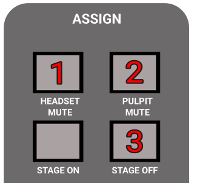
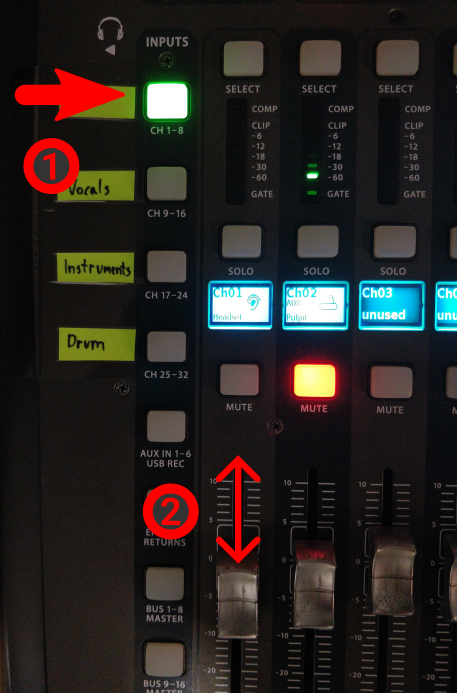

<h1>HOW TO DO A/V FOR BIBLESCHOOL</h1>

----

<h2>Table of contents</h2>

<!-- TOC -->
* [Turning on](#turning-on)
* [Setup](#setup)
* [Configure the console](#configure-the-console)
* [Prepare for going live](#prepare-for-going-live)
* [Finishing](#finishing)
* [Troubleshooting](#troubleshooting)
  * [No audio input coming to OBS](#no-audio-input-coming-to-obs)
  * [Projector colors are incorrect](#projector-colors-are-incorrect)
    * [Just slightly off](#just-slightly-off)
    * [Very off](#very-off)
<!-- TOC -->

# Turning on
1. Follow the [Turning on the audio system](../../labels/turningon.pdf) guide.
    1. You may skip the "coffee shop" step, if you don't have people there.

1. Turn on the following sockets/switches:
    * "PC + OTHERS"
    * "Network"
    * "Screens"
    * "Screens + Sockets + Projector"

1. Move the pulpit to the marked position on the floor, or put the chair on the marked position.

1. Turn on the projector & bring down the projection-screen.

1. Turn on the TV on the pole, with the remote control, that is labeled "CENTURY"

1. Turn on the TV in the coffee shop too, if needed.

# Setup

1. Connect the "**FROM PULPIT**" HDMI cable with the extender to the "**TO PROJECTOR**" cable.

1. Put the little keyboard (with 4 buttons) outside the audio cave, where the person managing it (may be you:)) will
   sit. It is on a long extension cable for this reason.
    1. Use the "Cam. Toggle" button on it, to switch between the camera and the slides.

1. Put batteries into the headset
    1. Based on the day, select the right pair of batteries
    2. Push the button at the back of the headset and while pushing, slide down the backplate.
    3. Put in batteries, close back.
    4. Long press the single button at the top to turn it on.

    

# Configure the console
1. Load the CCP SERVICE READONLY scene in the console
    1. Press VIEW at the "SCENES" section
    2. Rotate the first knob under the display (labeled GO) until the selection is on CCP Service READONLY.
    3. Press the first knob (labeled "GO")

1. Set up the MAIN bus.
    1. Mute button should not be red.
    2. Set Main fader to 0 (thats not the lowest position)

     

1. Find the "ASSIGN" section on the mixer, on the right side.
    1. Make the "**HEADSET MUTE**" button **UNLIT**/GRAY, by pressing it if needed.
    2. Make the "**PULPIT MUTE**" **LIT** by pressing it if needed.
    3. Press "**STAGE OFF**": it will not light up, just press it once.
        1. Press the "CONFIRM" knob on the display.

     
     
     

    

1. Set the headset volume properly
    * Select the "SPEAKER" layer
    * Move the first, "HEADSET" channel's fader up and down as needed.

     
     

    

# Prepare for going live
1. Turn on the PC & LOG IN
    1. The power button is on the top of the PC.
    2. OBS should have started automatically after login. 

# Lifecycle of the stream

### BEFORE THE CLASS STARTS
 * Select and make live the appropriate "**EVENT PRE STREAM**" scene.
 * This starts the live stream with pre-stream image/audio so people can tune in.

### WHEN THE CLASS STARTS
 * Make live the "**Pulpit**" or "**Sitting**" scene in OBS.

### WHEN GOING ON BREAK
 * Make live the "**EVENT BREAK**" scene.

### WHEN RETURNING FROM A BREAK
 * Make live the "**Pulpit**" or "**Sitting**" scene in OBS.

### AT THE END
 * Make live the "**EVENT FINISHED**" scene.
 * This will cut recording and streaming after a little delay.
 
    

# Finishing

1. Press "STOP RECORDING" in OBS.
1. Turn off the projector.
1. Close back the projector-screen.
1. Put back the little keyboard.
1. Get the headset batteries out and put them back into the charger.
1. Put the headset back to the shelf.
1. Restore the HDMI cables as they were (unplug, and reconnect the USB grabber)

1. Wait for the recordings to upload.

   **If you can**, please wait about 15 minutes to pass between "stop recording", and turning off the PC.
   The computer automatically uploads the recordings of this class, so that our crew could edit/upload/manage it.

   You can check on the status by clicking on the:
   **System tray → Google Drive icon**, and verifying that a file with today's date is being/was uploaded.

   
   
1. Turn off the computer.
1. Finally, follow the [Turning off the audio system](../../labels/turningoff.pdf) guide.

# Troubleshooting

## No audio input coming to OBS

If you see, that there is no audio coming to OBS:

Sometimes the audio input device in OBS is reset to something else, than LINE IN.

1. Click on the audio input's three dots (the one that is the highest)
1. Select Properties
1. Select LINE IN
1. Press OK

## Projector colors are incorrect
Make sure to put something on the screen, e.g. a webpage or an image that you know already, and you know what colors to expect.
Don't trust the background image on macbooks.

### Just slightly off
If it is slightly off, e.g. whites are yellow, the projector's image mode is changed.

   * Using the remote controller of the projector (white, asus label), go into it's menu.
   * Image settings
   * Select sRGB.

### Very off
E.g. if many colors are changed, usually blue turns to green, many things to pink, etc.

Then on the Macbook the settings of the display must be adjusted.

 * Make sure that "True tone" is off
 * Select color profile sRGB

If nothing works, usually "mirroring" instead of "extending" fixes everything no matter what.

