<h1>How to manage a general event with projection & streaming</h1>

----

E.g.: Bible school, ad-hoc events, etc.

<h2>Table of contents</h2>

<!-- TOC -->
* [Prepare](#prepare)
* [Turning on](#turning-on)
* [Setup projection](#setup-projection)
* [Setup headset](#setup-headset)
* [Configure the console](#configure-the-console)
    * [BEFORE THE EVENT STARTS](#before-the-event-starts)
    * [WHEN THE EVENT STARTS](#when-the-event-starts)
    * [DURING THE EVENT](#during-the-event)
    * [WHEN GOING ON A BREAK](#when-going-on-a-break)
    * [WHEN RETURNING FROM A BREAK](#when-returning-from-a-break)
    * [AT THE END](#at-the-end)
* [Remote control](#remote-control)
* [Camera](#camera)
  * [Changing angles](#changing-angles)
  * [Manual adjustment](#manual-adjustment)
* [Finishing](#finishing)
<!-- TOC -->

# Prepare
You want to check out the introduction video about how to use the small keyboard: [https://youtu.be/NiLRXe7hhSY](https://youtu.be/NiLRXe7hhSY)

# Turning on

1. Follow the [Turning on the audio system](../../labels/turningon.pdf) guide.
    1. SKIP the "coffee shop" step, if you don't have people there.
    2. DON'T skip the STAGE step, you need it.
   
2. Move the pulpit to the marked position on the floor, or put the chair on the floor-marked position.

3. Turn on the following switch:
    * "Screens + Sockets + Projector"

# Setup projection

1. Turn on the projector & bring down the projection-screen. 

5. Set up the device that is being used for projection on the pulpit:
    * Enable "Extended display"
    * Set resolution to 1080p (1920x1080)
    * On MAC devices:
        * Turn off "True Tone"
        * Select "sRGB-IEC..." color profile

# Setup headset

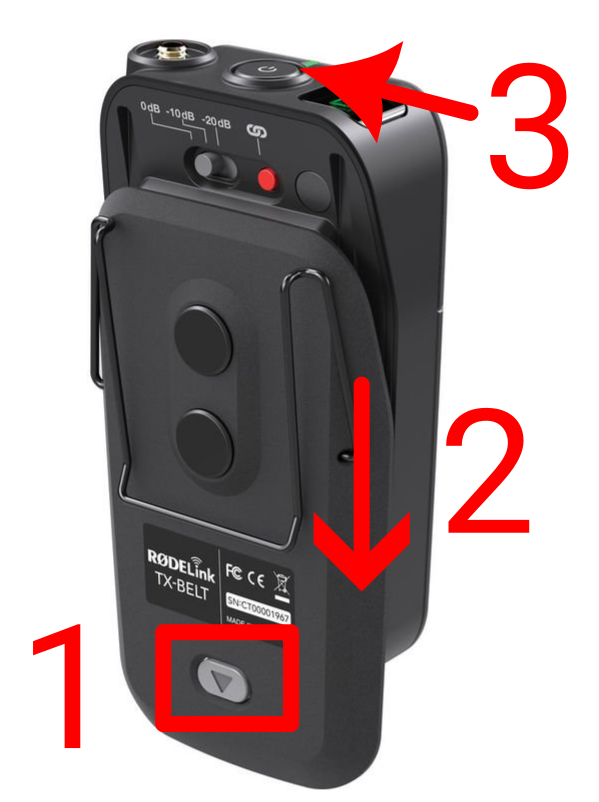

1. Above the mixing console, on the shelf you'll find the battery charger.
2. Based on the labels on the charger, select the appropriate set of batteries.
3. The headset should be there too.
4. Press the button on the headset. (see image, point #1)
5. While pressing the button, slide down the back side. (see image, point #2)
6. Put batteries in.
7. Close it back.
8. Turn it on by long pressing the button on top. (see image, point #3)
    * It should lit up green, displaying 8 on the display.

 

# Configure the console

1. Load the **SERVICE READONLY** scene in the console:
    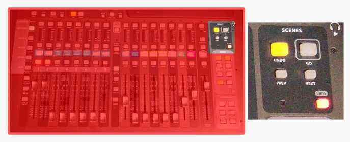 
    1. Press **{Scenes/VIEW}**
    2. Turn **{Knobs/GO}**: to select "SERVICE READONLY".
    3. Press **{Knobs/GO}**: to load the scene.
    4. Press **{Knobs/CONFIRM}**: to really load the scene.
     

    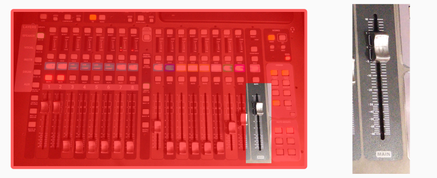 
     
   
1. Press **{Assign/HEADSET MUTE}** (it should not be lit)
    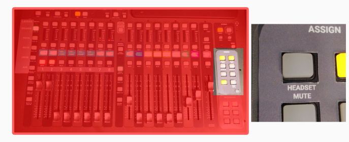
    

4. Press **{Assign/STAGE OFF}** (it will not light up)
    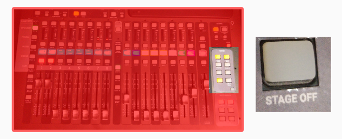

5. Press **{Knobs/CONFIRM}** under the display.
    

6. Set the speaker volume properly
    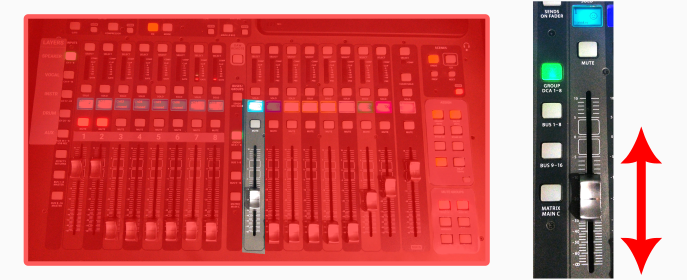 

     

### BEFORE THE EVENT STARTS

  

* Press **FN** + **PRE STREAM** ( +  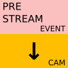)  to transition to live.   

* This starts the live stream so people can start to tune in online.
* Do this 10+ mins before the event, to give time for the  online audience to join.

### WHEN THE EVENT STARTS

* Press  **SHOW CAMERA** () to start the event. 

### DURING THE EVENT

* Press **PULPIT TOGGLE** () to switch between the camera and the presentation from the pulpit PC.

### WHEN GOING ON A BREAK

* Press **FN** + **BREAK** ( + 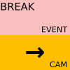). 

### WHEN RETURNING FROM A BREAK

* Press **SHOW CAMERA** () to get out of the break mode. 

### AT THE END

* Press **FN** + **FINISH** ( + )

* This will end recording and streaming after some delay.

# Remote control

You can control the keyboard remotely through a web interface. 
This allows you to remain outside the audio booth while managing slide and camera transitions—ideal for technicians or presenters. 
Pastors or other speakers can also operate the controls themselves if desired.
Sitting in the audio booth can be distracting, so in this case this will come useful to you.

1. Connect to the **Staff WiFi** network (it only works from this or the Tech network)
2. Open this address: [https://192.168.2.10/remote](https://192.168.2.10/remote/)
3. Get through the warning "**This Connection Is Not Private**":
    * Click on "**Show details**" or "Advanced" or "More"
    * Click on "**Accept**" or "Proceed to ..." or similar.

4. Ask the password from the tech team, or the one showing you this:)
5. You should get to this:
 
   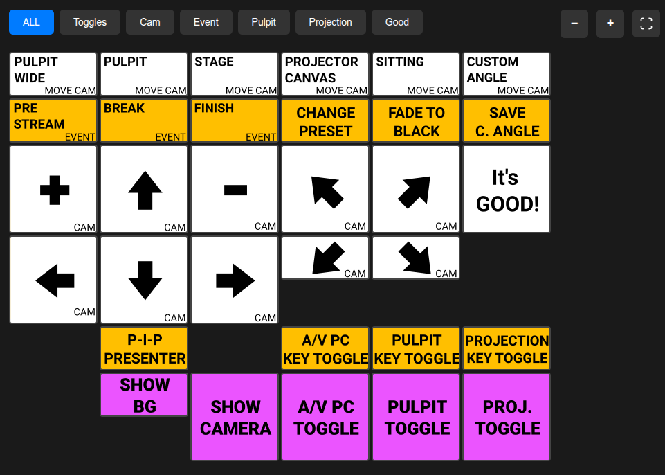

Now this is the full keyboard, but for simplicity sake, you probably want to go to the "Pulpit" or "Projection"
tabs, depending on where the slides will come. On Bible school, the preacher's computer will be on the "Pulpit":

  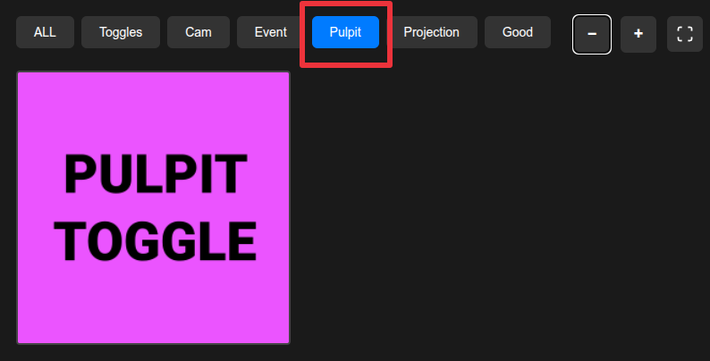

This website will try to keep your phone's display light constantly on, to prevent the lockscreen coming in.
So you can lower the brightness of your screen and put it next to you, so you can just conveniently touch the button to switch whenever you want.

# Camera
## Changing angles
If you ever need to change the camera angle, then press any of these once, to reload camera positions:

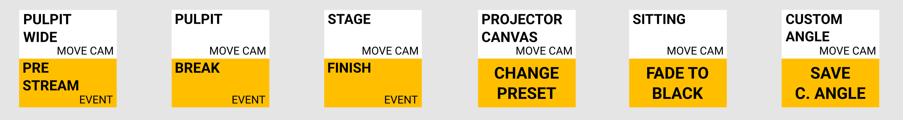

## Manual adjustment
To manually move or zoom the camera, press any of these:

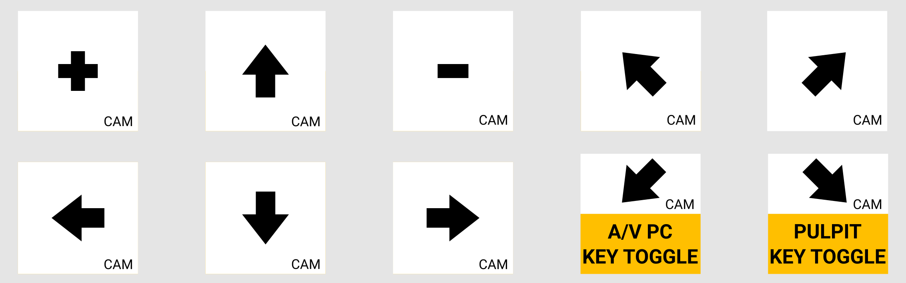

# Finishing

1. Turn off the projector.
2. Close back the projector-screen.
3. Take out the headset batteries and put them back into the charger. Please pay attention to the polarity.
4. Put the headset back to the shelf.
5. Wait for the recordings to synchronize:

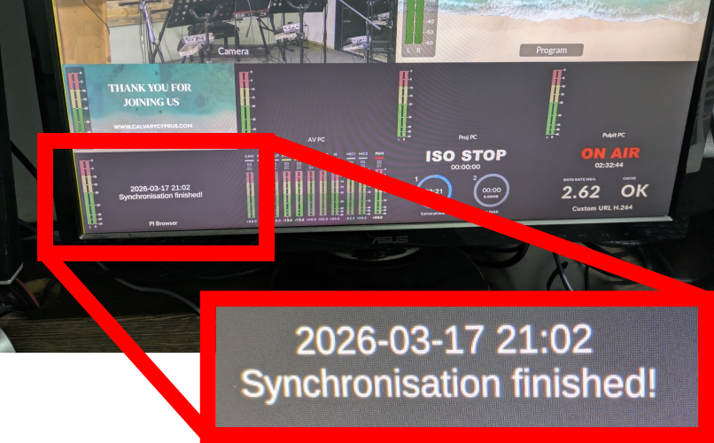

6. Finally, follow the [Turning off the audio system](../../labels/turningoff.pdf) guide.

