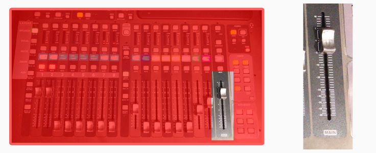
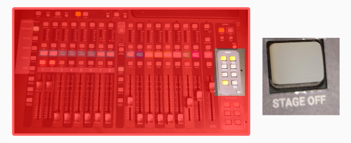
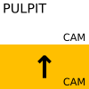
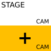

<h1>How to manage a general event with projection & streaming</h1>

----

E.g.: Bible school, ad-hoc events, etc.

<h2>Table of contents</h2>

<!-- TOC -->
* [Prepare](#prepare)
* [Turning on](#turning-on)
* [Setup projection](#setup-projection)
* [Setup headset](#setup-headset)
* [Configure the console](#configure-the-console)
* [Prepare for going live](#prepare-for-going-live)
* [Lifecycle of the stream](#lifecycle-of-the-stream)
    * [BEFORE THE EVENT STARTS](#before-the-event-starts)
    * [WHEN THE EVENT STARTS](#when-the-event-starts)
    * [DURING THE EVENT](#during-the-event)
    * [WHEN GOING ON A BREAK](#when-going-on-a-break)
    * [WHEN RETURNING FROM A BREAK](#when-returning-from-a-break)
    * [AT THE END](#at-the-end)
* [Optional camera management](#optional-camera-management)
  * [Changing camera angles](#changing-camera-angles)
  * [Manual camera adjustment](#manual-camera-adjustment)
* [Finishing](#finishing)
<!-- TOC -->

# Prepare
You want to check out the introduction video about how to use the small keyboard: [https://youtu.be/bivtL445jj4](https://youtu.be/bivtL445jj4)

# Turning on

1. Follow the [Turning on the audio system](../../labels/turningon.pdf) guide.
    1. SKIP the "coffee shop" step, if you don't have people there.
    2. DON'T skip the STAGE step, you need it.
   
2. Move the pulpit to the marked position on the floor, or put the chair on the floor-marked position.

3. Turn on the following sockets/switches:
    * "PC + OTHERS"
    * "Network"
    * "Screens"
    * "Screens + Sockets + Projector"

# Setup projection

1. Connect the "**FROM PULPIT**" HDMI cable with the extender to the "**TO PROJECTOR**" cable, if the preacher is presenting.

2. Turn on the projector & bring down the projection-screen. 

3. Turn on the "Century" TV on the pole, with the remote control, that is labeled "CENTURY".
    * The remote is usually above or around the console.

4. Turn on the TV in the coffee shop too, if needed.

5. Set up the device that is being used for projection:
    * Enable "Extended display"
    * Set **screen refresh rate to 50HZ** on the extended display. Very important.
    * Set resolution to 1080p (1920x1080)
    * On MAC devices:
        * Turn off "True Tone"
        * Select "sRGB-IEC..." color profile

6. Make sure the projector is in sRGB mode (there is an "image mode" button on the remote). 
   * Some MACs reset it to "HDR SIM", that WILL NOT WORK

# Setup headset

1. Above the mixing console, on the shelf you'll find the battery charger.
2. Based on the labels on the charger, select the appropriate set of batteries.
3. The headset should be there too.
4. Press the button on the headset. (see image, point #1)
5. While pressing the button, slide down the back side. (see image, point #2)
6. Put batteries in.
7. Close it back.
8. Turn it on by long pressing the button on top. (see image, point #3)
    * It should lit up green, displaying 8 on the display.

 

# Configure the console

1. Load the **SERVICE READONLY** scene in the console:
     
    1. Press **{Scenes/VIEW}**
    2. Turn **{Knobs/GO}**: to select "SERVICE READONLY".
    3. Press **{Knobs/GO}**: to load the scene.
    4. Press **{Knobs/CONFIRM}**: to really load the scene.
     
   
2. Set **{MAIN/Fader}** to 0. (Note: Zero is not the lowest position!)

     
     
   
3. Press **{Assign/HEADSET MUTE}** (it should not be lit)
    
    

4. Press **{Assign/STAGE OFF}** (it will not light up)
    

5. Press **{Knobs/CONFIRM}** under the display.
    

6. Set the speaker volume properly
     

     

# Prepare for going live

1. Turn on the PC & LOG IN
    1. The power button is on the top of the PC.
    2. OBS should have started automatically after login.

# Lifecycle of the stream

### BEFORE THE EVENT STARTS

* Press 
  

* Press  together with    to transition to live.   

* This **starts the live stream** so people can start to tune in online.
* Do this 10+ mins before the event, to give time for the  online audience to join.

### WHEN THE EVENT STARTS

* Press  OR , which ever is appropriate.

* Press  together with   to transition to live.

* Switching away from "PRE STREAM" **starts the recording**.

### DURING THE EVENT

* Press  to switch between the camera and the presentation.

### WHEN GOING ON A BREAK

* Press .

* Press  together with   to transition to live.

* This **pauses the recording**.
* This also mutes the live stream, but not mutes anything in the room, you might wanna do that manually with **{ASSIGN/Headset Mute}**.

### WHEN RETURNING FROM A BREAK

* Press  OR , which ever is appropriate.

* Press  together with   to transition to live.

* This **resumes recording**.

### AT THE END

* Press .

* Press  together with   to transition to live.

* This will **end recording and streaming** after a minute-long delay.

# Optional camera management
## Changing camera angles
If you ever need to change the camera angle:

 * Press any of these once: 

 * Press  together with   to transition to live.

## Manual camera adjustment
To manually move or zoom the camera:

* Press & hold 

* Press any of these:  
  
  
   
  
  
  

# Finishing

1. Turn off the projector.
2. Close back the projector-screen.
3. Get the headset batteries out and put them back into the charger. Please pay attention to the polarity.
4. Put the headset back to the shelf.
5. Restore the HDMI cables as they were (unplug, and reconnect the USB grabber)

6. Wait for the recordings to upload.

   **If you can**, please wait about 5-10 minutes to pass between the end of the stream, and turning off the PC.
   The computer automatically uploads the recordings of this event, so that our crew could edit/upload/manage it.

   You can check on the status by clicking on the:
   **System tray → Google Drive icon**, and verifying that a file with today's date is being/was uploaded.

   

7. Turn off the computer.
8. Finally, follow the [Turning off the audio system](../../labels/turningoff.pdf) guide.

