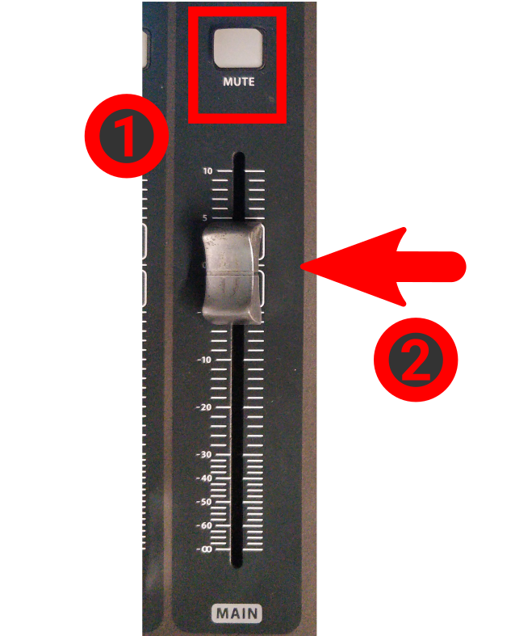

<h1>How to manage a general event with projection & streaming</h1>

----

E.g.: Bible school, ad-hoc events, etc.

<h2>Table of contents</h2>

<!-- TOC -->
* [Turning on](#turning-on)
* [Setup projection](#setup-projection)
* [Setup headset](#setup-headset)
* [Configure the console](#configure-the-console)
* [Prepare for going live](#prepare-for-going-live)
* [Lifecycle of the stream](#lifecycle-of-the-stream)
  * [Use the small keyboard](#use-the-small-keyboard)
    * [BEFORE THE EVENT STARTS](#before-the-event-starts)
    * [WHEN THE EVENT STARTS](#when-the-event-starts)
    * [DURING THE EVENT](#during-the-event)
    * [WHEN GOING ON A BREAK](#when-going-on-a-break)
    * [WHEN RETURNING FROM A BREAK](#when-returning-from-a-break)
    * [AT THE END](#at-the-end)
* [Finishing](#finishing)
* [Troubleshooting](#troubleshooting)
  * [No audio input coming to OBS](#no-audio-input-coming-to-obs)
  * [Restarting the stream on one of the platforms](#restarting-the-stream-on-one-of-the-platforms)
<!-- TOC -->

# Turning on

1. Follow the [Turning on the audio system](../../labels/turningon.pdf) guide.
    1. You may skip the "coffee shop" step, if you don't have people there.

2. Move the pulpit to the marked position on the floor, or put the chair on the floor-marked position.

3. Turn on the following sockets/switches:
    * "PC + OTHERS"
        * next to the console
    * "Network"
        * on the left of the pc screens
    * "Screens"
        * on the left of the pc screens
    * "Screens + Sockets + Projector"
        * on the right of the pc screens, close to the light switches

# Setup projection

1. Connect the "**FROM PULPIT**" HDMI cable with the extender to the "**TO PROJECTOR**" cable, if the preacher is presenting.

2. Turn on the projector & bring down the projection-screen.

3. Turn on the "Century" TV on the pole, with the remote control, that is labeled "CENTURY".
    * The remote is usually above or around the console.

4. Turn on the TV in the coffee shop too, if needed.

5. Set up the device that is being used for projection:
    * Enable "Extended display"
    * Set **screen refresh rate to 50HZ** on the extended display 
      * The default is 60, but that might cause wrong projector colors, and it WILL cause
        running-lines effect with the camera.
    * Set resolution to 1080p (1920x1080)
    * On MAC devices:
        * Turn off "True Tone"
        * Select "sRGB-IEC..." color profile

6. Make sure the projector is in sRGB mode (there is an "image mode" button on the remote). 
   * Some MACs reset it to "HDR SIM", that WILL NOT WORK (will cause wrong colors).

# Setup headset

1. Based on the day, select the right pair of batteries from the charger.
2. Push the button at the back of the headset and while pushing, slide down the backplate.
3. Put in batteries, close back.
4. Long press the single button at the top to turn it on, make sure it is green.

# Configure the console

1. Load the **CCP SERVICE READONLY** scene in the console:
    1. Press **{Scenes/VIEW}**
    2. Turn **{Knobs/GO}**: to select "CCP SERVICE READONLY".
    3. Press **{Knobs/GO}**: to load the scene.
    4. Press **{Knobs/CONFIRM}**: to really load the scene.

2. Set up the MAIN bus.
    1. Make sure **{MAIN/Mute}** is not red. (Press it to toggle.)
    2. Set **{MAIN/Fader}** to 0 (that's not the lowest position)

     

3. Find the "ASSIGN" section on the mixer, on the right side.
    1. If **{Assign/PULPIT MUTE}** is gray, press it.
    2. If **{Assign/HEADSET MUTE}** is **NOT** gray, press it.
    3. Press **{Assign/STAGE OFF}**: it will not light up, just press it once.
        1. Press **{Knobs/CONFIRM}** under the display.

        
        
        

       

4. Set the headset volume properly
    * Press **{GROUP DCA 1-8}** if it is not green (in the middle)
        * Next to this button on the right is the SPEAKER group.
    * Set **{Groups/SPEAKER}** to 0 (that's not the lowest position).

    * Press **{Layers/SPEAKER}**
    * Move the first, "HEADSET" channel's fader up and down as needed.

     
     

# Prepare for going live

1. Turn on the PC & LOG IN
    1. The power button is on the top of the PC.
    2. OBS should have started automatically after login.

# Lifecycle of the stream

## Use the small keyboard

In the following paragraphs, the term "make live" means you can use the keyboard.

* Press the appropriate button to bring up the scene in the preview section.
* Press FN + TRANSITION together to make it "live".

### BEFORE the event starts

* Make live the "**PRE STREAM**" scene.
* It's best to go live 15-20 mins before, to have ample time to fix issues for you and for the audience.
* This starts the live stream with pre-stream image/audio so people can tune in, check audio/video settings.

### WHEN THE EVENT STARTS

* Make live the "**PULPIT**" or "**SITTING**" scene.
* Switching away from "PRE STREAM" triggers the recording to start.

### DURING THE EVENT

* Toggle between the camera and the projector with the "**CAM TOGGLE**" button as needed.

### WHEN GOING ON A BREAK

* Make live the "**EVENT BREAK**" scene.
* This pauses the recording, keeps live stream with a waiting screen.
* This also mutes the live stream, but not mutes anything in the room, you might wanna do that manually with **{Layers/Speaker/Headset/Mute}**.

### WHEN RETURNING FROM A BREAK

* Make live the "**PULPIT**" or "**SITTING**" scene.
* This resumes recording.

### AT THE END

* Make live the "**FINISH**" scene.
* This will cut recording and streaming after a minute-long delay.

# Finishing

1. **RESET PROJECTOR IMAGE MODE**
    * Disconnect the laptop from the projector.
    * On the remote press "MODE".
    * Select sRGB if needed.
2. Turn off the projector.
3. Close back the projector-screen.
4. Put back the little keyboard.
5. Get the headset batteries out and put them back into the charger. Please pay attention to the polarity.
6. Put the headset back to the shelf.
7. Restore the HDMI cables as they were (unplug, and reconnect the USB grabber)

8. Wait for the recordings to upload.

   **If you can**, please wait about 5-10 minutes to pass between the end of the stream, and turning off the PC.
   The computer automatically uploads the recordings of this event, so that our crew could edit/upload/manage it.

   You can check on the status by clicking on the:
   **System tray → Google Drive icon**, and verifying that a file with today's date is being/was uploaded.

   

9. Turn off the computer.
10. Finally, follow the [Turning off the audio system](../../labels/turningoff.pdf) guide.

# Troubleshooting

## No audio input coming to OBS

If you see, that there is no audio coming to OBS:

Sometimes the audio input device in OBS is reset to something else, than LINE IN.

1. Click on the audio input's three dots (the one that is the highest)
2. Select Properties
3. Select LINE IN
4. Press OK

## Restarting the stream on one of the platforms

@TODO This section is under construction.

