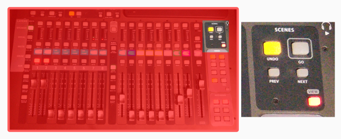
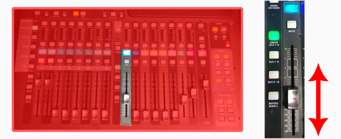

<h1>How to manage a general event with projection & streaming</h1>

----

E.g.: Bible school, ad-hoc events, etc.

<h2>Table of contents</h2>

<!-- TOC -->
* [Prepare](#prepare)
* [Turning on](#turning-on)
* [Setup projection](#setup-projection)
* [Setup headset](#setup-headset)
* [Configure the console](#configure-the-console)
    * [BEFORE THE EVENT STARTS](#before-the-event-starts)
    * [WHEN THE EVENT STARTS](#when-the-event-starts)
    * [DURING THE EVENT](#during-the-event)
    * [WHEN GOING ON A BREAK](#when-going-on-a-break)
    * [WHEN RETURNING FROM A BREAK](#when-returning-from-a-break)
    * [AT THE END](#at-the-end)
* [Optional camera management](#optional-camera-management)
  * [Changing camera angles](#changing-camera-angles)
  * [Manual camera adjustment](#manual-camera-adjustment)
* [Finishing](#finishing)
<!-- TOC -->

# Prepare
You want to check out the introduction video about how to use the small keyboard: [https://youtu.be/NiLRXe7hhSY](https://youtu.be/NiLRXe7hhSY)

# Turning on

1. Follow the [Turning on the audio system](../../labels/turningon.pdf) guide.
    1. SKIP the "coffee shop" step, if you don't have people there.
    2. DON'T skip the STAGE step, you need it.
   
2. Move the pulpit to the marked position on the floor, or put the chair on the floor-marked position.

3. Turn on the following switch:
    * "Screens + Sockets + Projector"

# Setup projection

1. Turn on the projector & bring down the projection-screen. 

5. Set up the device that is being used for projection on the pulpit:
    * Enable "Extended display"
    * Set resolution to 1080p (1920x1080)
    * On MAC devices:
        * Turn off "True Tone"
        * Select "sRGB-IEC..." color profile

# Setup headset

1. Above the mixing console, on the shelf you'll find the battery charger.
2. Based on the labels on the charger, select the appropriate set of batteries.
3. The headset should be there too.
4. Press the button on the headset. (see image, point #1)
5. While pressing the button, slide down the back side. (see image, point #2)
6. Put batteries in.
7. Close it back.
8. Turn it on by long pressing the button on top. (see image, point #3)
    * It should lit up green, displaying 8 on the display.

 

# Configure the console

1. Load the **SERVICE READONLY** scene in the console:
     
    1. Press **{Scenes/VIEW}**
    2. Turn **{Knobs/GO}**: to select "SERVICE READONLY".
    3. Press **{Knobs/GO}**: to load the scene.
    4. Press **{Knobs/CONFIRM}**: to really load the scene.
     

     
     
   
1. Press **{Assign/HEADSET MUTE}** (it should not be lit)
    
    

4. Press **{Assign/STAGE OFF}** (it will not light up)
    

5. Press **{Knobs/CONFIRM}** under the display.
    

6. Set the speaker volume properly
     

     

### BEFORE THE EVENT STARTS

  

* Press FN + PRE STREAM ( +  )  to transition to live.   

* This **starts the live stream** so people can start to tune in online.
* Do this 10+ mins before the event, to give time for the  online audience to join.

### WHEN THE EVENT STARTS

* Press  to start the event. 

### DURING THE EVENT

* Press  to switch between the camera and the presentation from the pulpit PC.

### WHEN GOING ON A BREAK

* Press FN + BREAK ( + ). 

### WHEN RETURNING FROM A BREAK

* Press  to get out of the break mode. 

### AT THE END

* Press FN + FINISH ( + )

* This will **end recording and streaming** after some delay.

# Optional camera management
## Changing camera angles
If you ever need to change the camera angle:

 * Press any of these once, to reload camera positions:

## Manual camera adjustment
To manually move or zoom the camera:

* Press any of these: 

  

# Finishing

1. Turn off the projector.
1. Close back the projector-screen.
1. Take out the headset batteries and put them back into the charger. Please pay attention to the polarity.
1. Put the headset back to the shelf.
1. Finally, follow the [Turning off the audio system](../../labels/turningoff.pdf) guide.

