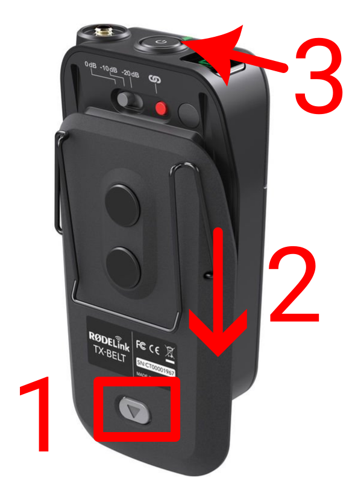
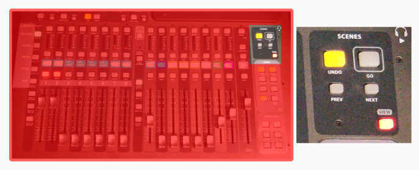
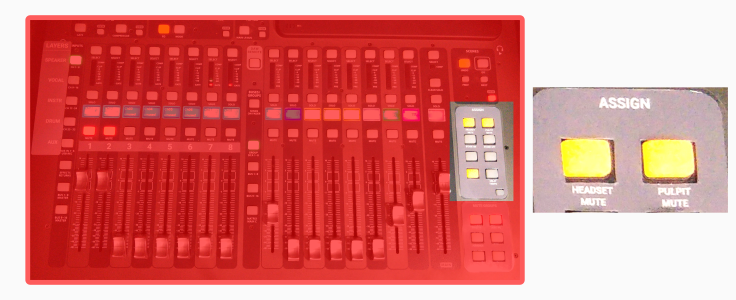
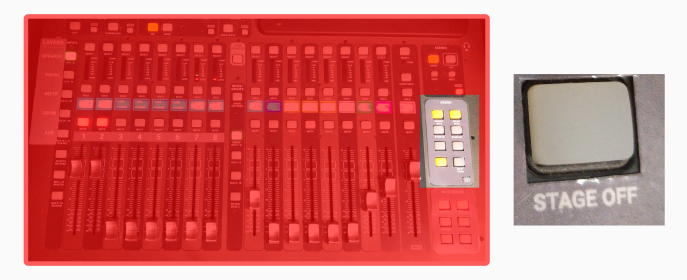
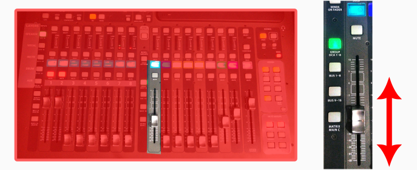

<h1>How to use the preaching microphones</h1>

This is the simplest guide that just lets you use the pulpit/headset without any recording, streaming or projection.

1. Follow the [Turning on the audio system](../../labels/turningon.pdf) guide.
    1. SKIP the "coffee shop" step, if you don't have people there.
    2. DON'T skip the STAGE step, if you want to use the headset.
   
2. Move the pulpit to the marked position on the floor.

# Setup headset

Only applies if you want to use it. If the pulpit mic is enough, skip.

1. Above the mixing console, on the shelf you'll find the battery charger & the headset.
2. Based on the labels on the charger, select the appropriate set of batteries.
3. Press the button on the headset. (see image, point #1)
4. While pressing the button, slide down the back side. (see image, point #2)
5. Put batteries in, close back.
6. Turn it on by long pressing the button on top. (see image, point #3)

 

# Configure the console

1. Load the **SERVICE READONLY** scene in the console: 
     
    1. Press **{Scenes/VIEW}**
    2. Turn **{Knobs/GO}**: to select "SERVICE READONLY".
    3. Press **{Knobs/GO}**: to load the scene.
    4. Press **{Knobs/CONFIRM}**.
 
   
2. Set **{MAIN/Fader}** to 0 (Zero is not the lowest position!)
    
     

3. Do only one of these
    
   * Press **{Assign/HEADSET MUTE}** to unmute it.
   * Press **{Assign/PULPIT MUTE}** to unmute it.
    
    
4. Press **{Assign/STAGE OFF}** (it will not light up)
    
5. Press **{Knobs/CONFIRM}** under the display.
     

6. Set the speaker volume properly
     

     

# Finishing

1. Take out the headset batteries and put them back into the charger. Please pay attention to the polarity.
2. Put the headset back to the shelf.
3. Finally, follow the [Turning off the audio system](../../labels/turningoff.pdf) guide.

