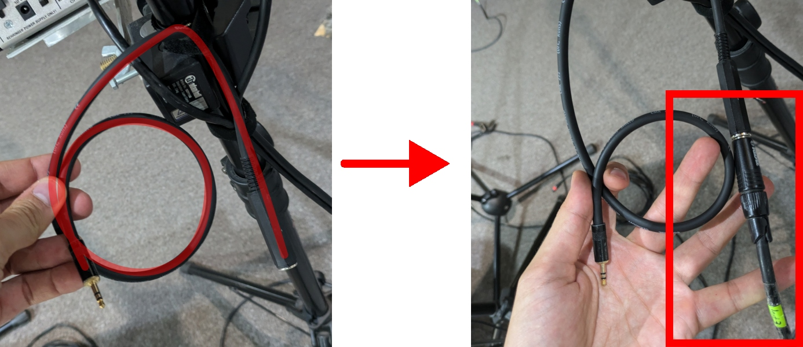
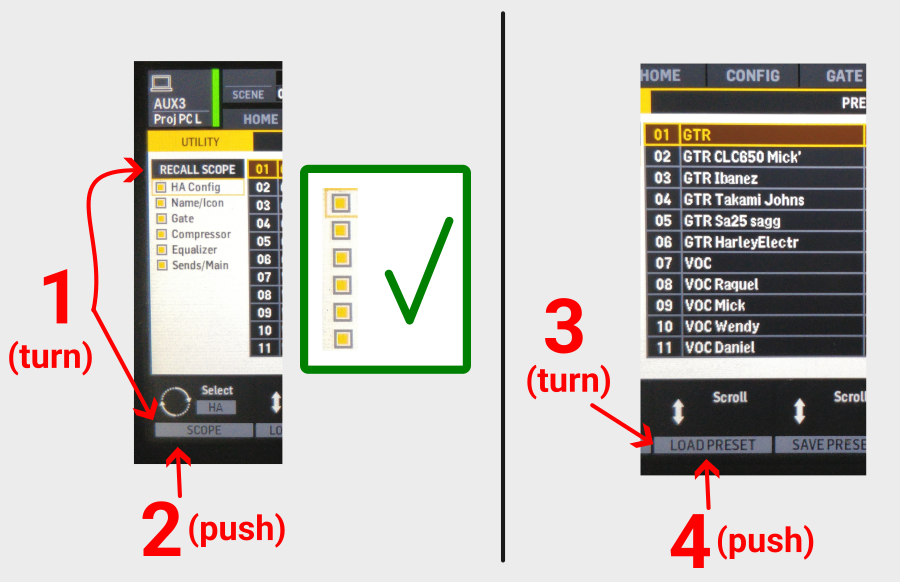
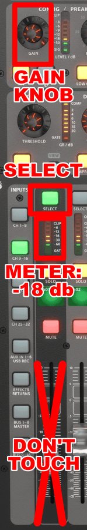
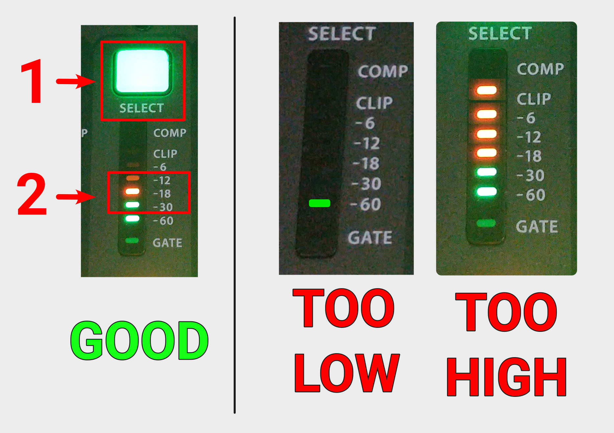

<h1>TASKS ON A REHEARSAL</h1>

----

<h2>Table of contents</h2>

<!-- TOC -->
* [Before the band arrives](#before-the-band-arrives)
  * [Check the band setup](#check-the-band-setup)
  * [Setup phone cable](#setup-phone-cable)
  * [Reset the stage mixers](#reset-the-stage-mixers)
  * [Stage housekeeping](#stage-housekeeping)
  * [At the main console](#at-the-main-console)
    * [Enable stage monitors if needed](#enable-stage-monitors-if-needed)
    * [Mute unused vocals](#mute-unused-vocals)
    * [Load channel presets](#load-channel-presets)
* [After the band arrives](#after-the-band-arrives)
  * [Gain staging](#gain-staging)
  * [Save the scene](#save-the-scene)
  * [During the rehearsal](#during-the-rehearsal)
    * [Set up a mix](#set-up-a-mix)
    * [Check stage monitors](#check-stage-monitors)
      * [Changing levels in stage monitors](#changing-levels-in-stage-monitors)
      * [Check if the stage is not too loud:](#check-if-the-stage-is-not-too-loud)
    * [If a vocalist sounds off-key or unexpected](#if-a-vocalist-sounds-off-key-or-unexpected)
* [After the rehearsal](#after-the-rehearsal)
  * [Save the scene](#save-the-scene-1)
  * [Close up](#close-up)
<!-- TOC -->

# Before the band arrives

You should be there ~20minutes before them, to be able to set up
everything professionally and to avoid hurry-induced errors, fix random issues, etc.

* Follow the "[Setting up the system](setup.md)" guide.
* Turn on the "Sockets, Screens, Projector" switch
* Turn on the PC

## Check the band setup

* Who will be at which mic on the stage?
* Who will use which instrument?

Our [worship scheduling](https://docs.google.com/spreadsheets/d/1CF_XKNQTk1d7-xo27YtngI1Acds7xjWmtpUdBukaisc) drive document should contain that information,
but alternatively you can consult about this with the worship leader as well.

## Setup phone cable

If they specified "Phone backing", "Phone click track" on INSTR3, then connect that instrument cable to the little adapter hanging at the back of
the second music stand.

 

## Reset the stage mixers

For all the stage mixers, including the one in the drum room, do the following, to reset them to their default working
state. 

ONLY DO THIS **BEFORE THE REHEARSAL**. DON'T DO THIS BEFORE THE SERVICE!

Do these in this order:

1. Turn it on, if it's not on (switch is on the back side)
2. **Reset the top-knobs** as follows (and also on the image):
     * Equalizers section knobs (first four): 12 o'clock
      * Limiter to MAX
    * Level to 3 o'clock
3. **Recall preset 16**:
     * Press and hold RECALL
      * Press 16
    * Release RECALL
   

## Stage housekeeping

* Tidy up cables, especially I.E.M. cables.
* Fold back unused microphones.
* Clean up, move away obstacles, trash, etc.

## At the main console

### Enable stage monitors if needed
If there is anyone on stage not using IEM you need to enable the closest stage monitor to that person.

   * If the person on MIC1 has no IEM, then unmute **{Layers/MONITOR/Monitor L}**
   * If the person on MIC2+ has no IEM, then unmute **{Layers/MONITOR/Monitor R}**

### Mute unused vocals

* Press **{Layers/VOCAL}**: to select the vocals layer.
* **Mute** unused channels between 1-6.
* Do not change channel 7 and 8.

### Load channel presets

Go through:

* **Vocal mics 1 to 6**, and
* **Instruments 1 to 5**

and for each used channel, load the appropriate preset, repeating the following steps:

1. Press **{Layers/VOCAL}** OR **{Layers/INSTR}**: to select the right layer.
2. Press **{Channel ?/SELECT}**: to select the channel where you want to load the preset.
3. Press **{Equalizer/VIEW}**:
    * No need to press again, if it is red already.

4. Press **{DisplaySide/UTILITY}**

5. Turn **{Knobs/SCOPE}**: and select the **RECALL SCOPE** option.

6. Press **{Knobs/SCOPE}**: to select **all scopes**.
    * It should look like the green area on the image.

7. Turn **{Knobs/LOAD PRESET}**: to select the appropriate preset.
    * "GTR ..." for guitars
    * "VOC ..." for vocalist (scroll down to find those)

8. Check, that you are on the right **LAYER** and the right **CHANNEL** is selected.

9. Press **{Knobs/LOAD PRESET}**: to load the preset.

10. Press **{Knobs/CONFIRM}**.

11. Repeat this section for the next vocal or instrument channel that is in use, or continue if you are finished.

Wait for the band to arrive:)

# After the band arrives

* **Ask them to set instrument controls to neutral**
    * Some instruments have equalizers on them, ask the owner to turn it off, or set it to "flat".
    * Some instruments have volume controls on them, ask the owner to set it to neutral, or middle.
    * And ask the owners of the instruments, not to change any of those during performing.

* **Check vocalist-microphone alignments**
    * Very important!
    * Align height and direction, so that the microphone is in line with the mouth, and points towards them. Ideally it
      points bottom up.
    * Meanwhile, keep it in a way so that the sound from the monitor would hit the microphone from the back as much as
      possible.

* Be nice, connect with them personally.
* Help them with what ever they ask.

## Gain staging

Go through: **Vocal 1-6**, **Instruments 1-5**: and for each used channel, check the gain.

Warnings & common pitfalls:

* Focus on these: Gain knob, Select button, Channel meter.
* In this step, you have no reason to touch ANY OF THE FADERS.
* No need to gain-stage the drums and the keyboard.
* Only adjust gain if there is input!
* Always, always, always check which channel is selected before turning the gain knob.
* If you need to turn up gain all the way to the top **something is wrong**.
    * Don't do this, even if the level remains too low. It will feedback and cause all sorts of problems.
    * Maybe the person is far, not singing on a proper volume, etc.

Checking the gain:

1. **Have input signal**: You **must have input coming in**, e.g. they must sing or play the
   instrument.

2. Press **{Layers/VOCAL}** OR **{Layers/INSTR}**: to select the right layer.
3. Press **{Channel ?/SELECT}**: to select the right channel.
4. Watch **{Channel ?/METER}**.
5. Adjust the **{GAIN}** knob at the console's top left corner until the meter jumps around -18db.  
   
    * Normal level: when the singer sings on a proper volume, close and straight to the mic. This is when it should be
      around -18db.
6. Repeat this section for the next vocal or instrument channel that is in use, or continue if finished.

**Channel gain should not be changed after this initial setup.**

## Save the scene

On the console:

1. Press **{Scenes/VIEW}**.
2. Turn **{Knobs/Save}** to scroll to the "**Service**" (**without** the "READONLY" part!) scene.
3. Press **{Knobs/SAVE}**: to save.
4. Press **{Knobs/BACKSPACE}**: to remove "READONLY" from the name if needed.
5. Press **{Knobs/SAVE}**.
6. Press **{Knobs/CONFIRM}**.

## During the rehearsal

### Set up a mix

1. Set up a mix with the 8 group faders on the right that sounds right.
    * The lead singer should be a bit louder than the other vocalists.
    * Set Vocal balance on the left side, on the VOCAL layer.
   
2. **PUT YOUR HEAD OUT** and listen!
3. Is the volume below the limit on the SPL meter?
4. Do you hear all instruments?
5. Do you hear all vocalists?
6. Do you hear the drum (from the speakers!? Watch for the hi-hats.)
7. Does all the singers sing into the microphone?
    * Are they far away from it, or angled in relation to it?
8. Did you ask the instrument players to reset their eq/volume levels?
9. Do they need any help?

### Check stage monitors

No need for any of this, if the stage monitors are not in use.

* Press **{SOLO CLEAR}**
* Press **{Layers/MONITOR/Monitor L/SOLO}** (later do the same with Monitor R!)
* Put up the headphones and check:
  * Everything is balanced (nothing is too loud)
  * Everyone who is needed in that speaker are present
  * Noone who is not needed present

#### Changing levels in stage monitors
If you need to edit the monitor mix:

 * Press **{Assign/? Monitor}** to enter the monitor mix mode (middle red button will blink)
 * Go to the layer where the channel you want to adjust is, e.g. Vocals, Instr.
 * Adjust carefully the channel fader up or down
 * Press **{Assign/? Monitor}** again to get out of the monitor mix mode. (middle red button should stop blinking)

#### Check if the stage is not too loud:

 * Momentarily press **{Main/MUTE}** to mute the room and hear how loud the stage is.
 * If an instrument or vocalist fills the room just from the monitors, edit the monitor mix (see above)
 * If the whole thing is just too loud, pull down the **{Monitors/Monitor L/R/Fader}**
 * Don't mute the room for long, it disturbs the band. Mute, listen, unmute.

Repeat this process everyonce in a while during rehearsal.

### If a vocalist sounds off-key or unexpected

Our singers are quite good and checked, so if they sound bad,
that is most likely due to them not hearing themselves correctly.

To solve this: check the monitors ([see above](#check-stage-monitors)).

Your goal is so that they would be a bit more present in the stage-monitor mix:

* Lower something that is too loud.
* Or increase their level in the monitor.
* Or increase the overall monitor level.

# After the rehearsal

## Save the scene

1. Press **{Scenes/VIEW}**.
2. Turn **{Knobs/Save}** to scroll to the "**Service**" (**without** the "READONLY" part!) scene.
3. Press **{Knobs/SAVE}**: to save.
4. Press **{Knobs/BACKSPACE}**: to remove "READONLY" from the name if needed.
5. Press **{Knobs/SAVE}**.
6. Press **{Knobs/CONFIRM}**.

## Close up

* SPL METER: Put it back onto the shelf above the console.

* Follow the "[Turning off the audio system](../labels/turningoff.pdf)" guide posted on the mixer door.
