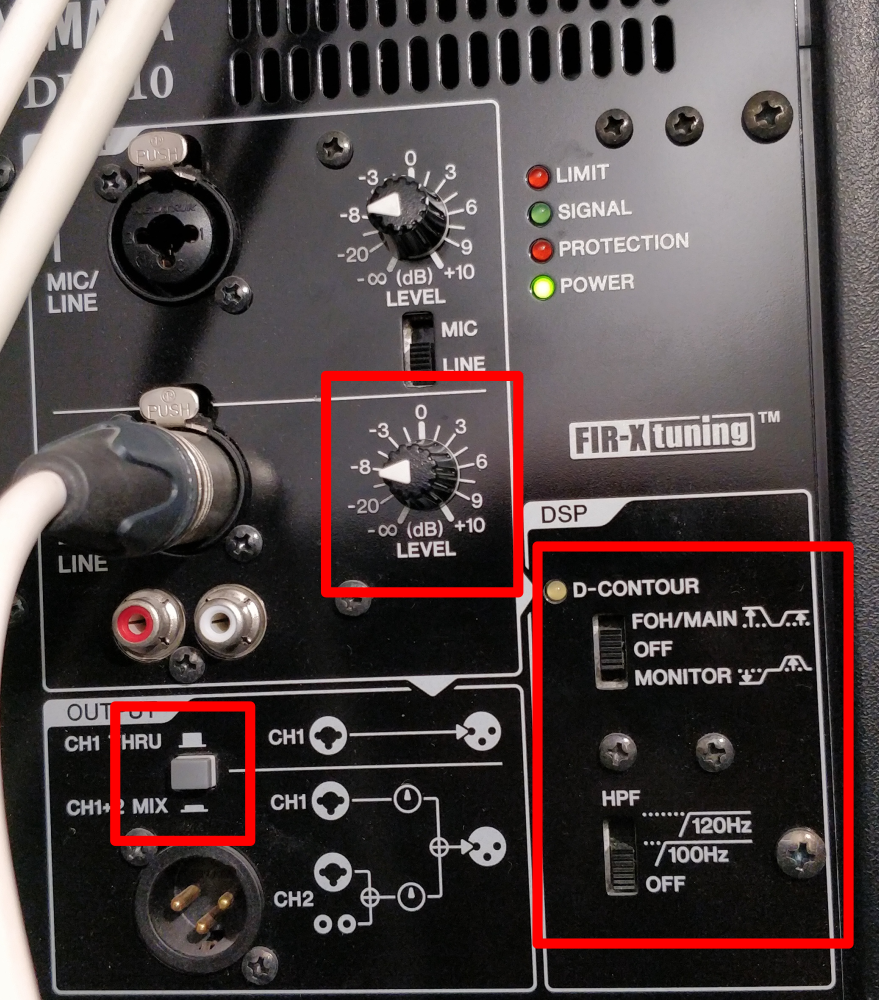
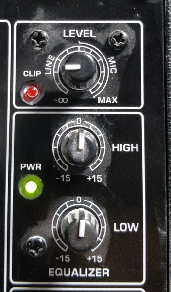
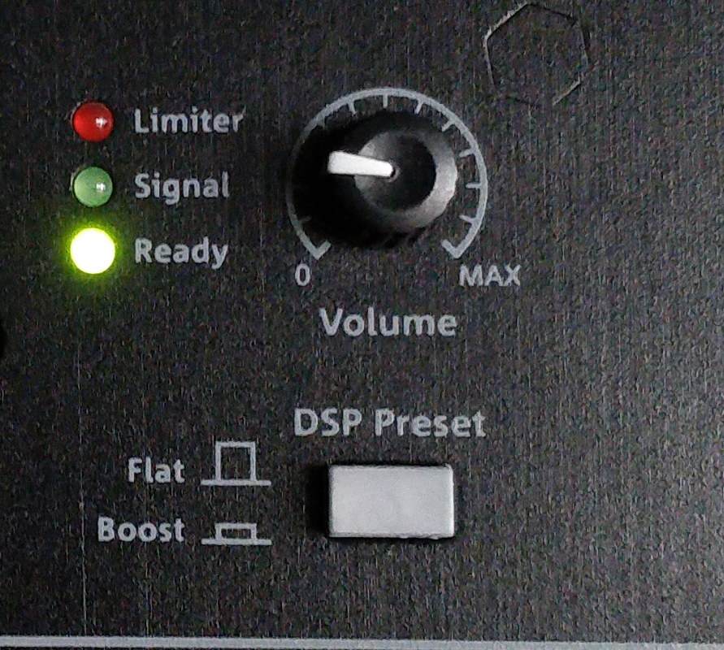
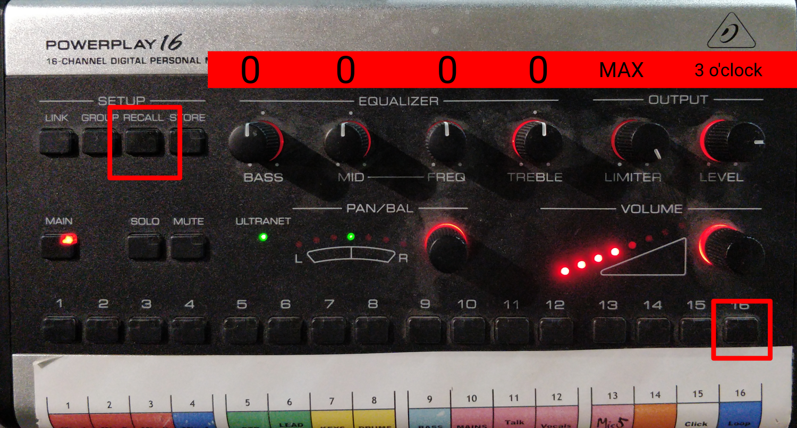
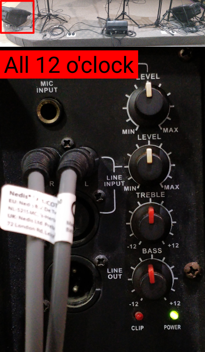
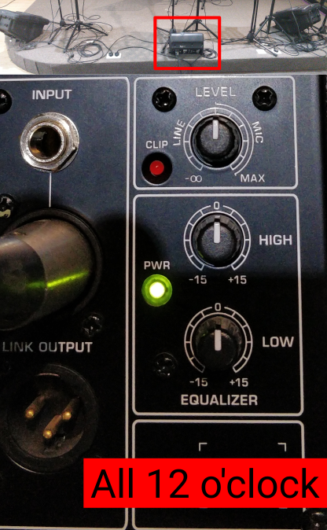
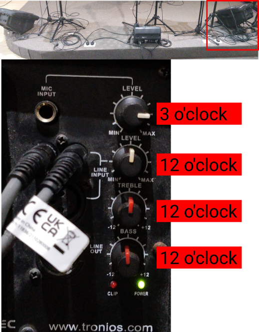
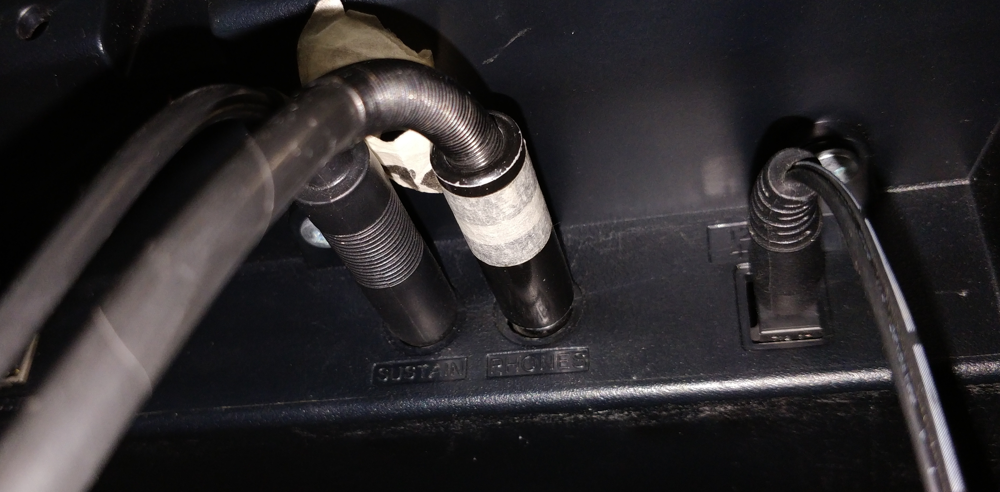
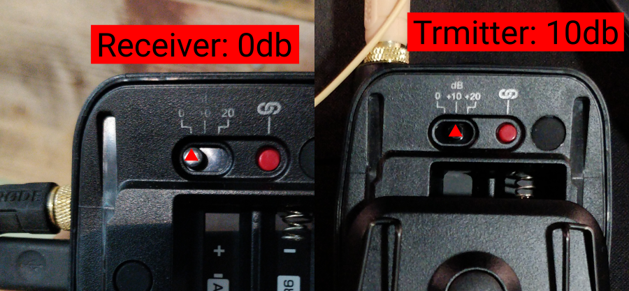

<h1>VERIFYING AND RESETTING THE SYSTEM STATE</h1>

<!-- TOC -->
* [Verify main speakers' settings](#verify-main-speakers-settings)
  * [Front](#front)
  * [Fills](#fills)
  * [Coffeshop](#coffeshop)
* [Align the pulpit](#align-the-pulpit)
* [Reset the stage](#reset-the-stage)
  * [Resetting the stage mixers](#resetting-the-stage-mixers)
  * [Verify stage mixers' connections](#verify-stage-mixers-connections)
  * [Verify stage monitor settings & connections](#verify-stage-monitor-settings--connections)
    * [Left](#left)
    * [Middle](#middle)
    * [Right](#right)
  * [Verify keyboard connection](#verify-keyboard-connection)
  * [Verify Rhode link settings](#verify-rhode-link-settings)
* [Check that all is working](#check-that-all-is-working)
<!-- TOC -->

# Verify main speakers' settings

## Front

* Ch 2 Level at **9 o'clock**
* DSP D-contour **OFF**
* DSP HPF **OFF**
* Gray button **NOT** pressed in

 

## Fills

* Level at 9 o'clock
* High at 0
* Low at 0

## Coffeshop

(This is here for reference, if you have no reason for it, you don't need to check it always.)

* Volume at 9 o'clock
* DSP preset button NOT pressed in

# Align the pulpit

There is a mark on the floor, align the pulpit to be at the correct position.

# Reset the stage

## Resetting the stage mixers

Reset the stage mixers, but only **BEFORE** a rehearsal.
There is one mixer in the drumroom too, reset that one also.

The order is important here:

1. Reset the top-knobs
    * Equalizers to **12 o'clock**
    * Limiter to **MAX**
    * Level to **3 o'clock**
2. Recall preset 16
    * Press and hold **RECALL**
    * Press **16**
    * **Release** RECALL

## Verify stage mixers' connections

Verify that the speakers are connected to **L/MONO**:

## Verify stage monitor settings & connections

### Left

* All 12 o'clock.
* Check power and signal cable connections.

### Middle

* All 12 o'clock.
* Check power and signal cable connections.

### Right

* This one is a bit damaged, the level should be at 3 o'clock!
* Check power and signal cable connections.

## Verify keyboard connection

Verify that it is connected properly, sometimes they unplug it for practicing.

## Verify Rhode link settings

(This is here for reference, if you have no reason for it, you don't need to check it always.)

* The receiver (the one on the wall) should be on 0db gain.
* The transmitter (the one with the mic) should be on 10db gain.

# Check that all is working

* Turn on the keyboard, and press one of the keys, you should hear it.
    * If not, check cables.

* Speak into each microphone, and you should hear yourself in each monitor.
    * If not:
        * check the main console for muting/stage off-ness.
        * check connections, stage mixer settings (e.g.: reset it properly)
     