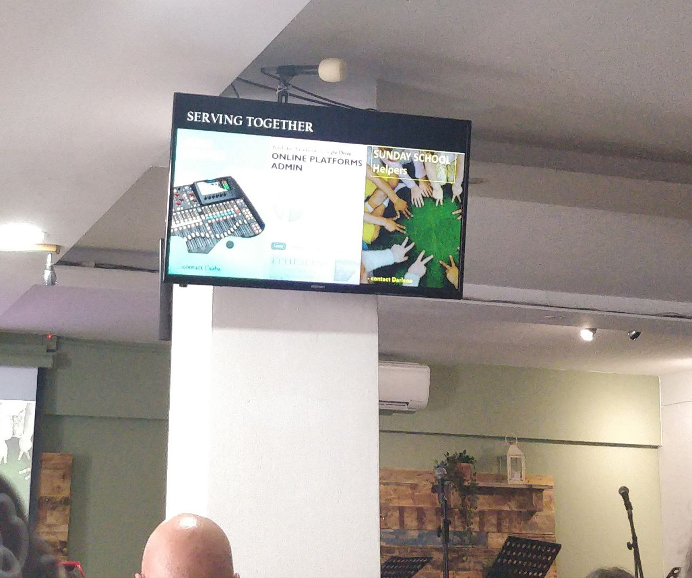

<h1>TASKS ON A SERVICE</h1>

----

<h2>Table of contents</h2>

<!-- TOC -->
* [Before the service](#before-the-service)
  * [Align the pulpit](#align-the-pulpit)
  * [Prepare for live-streaming](#prepare-for-live-streaming)
    * [Turn on the sockets](#turn-on-the-sockets)
    * [Turn on the pole-TV](#turn-on-the-pole-tv)
    * [Turn on the coffee-shop TV](#turn-on-the-coffee-shop-tv)
    * [Turn on the PC](#turn-on-the-pc)
    * [LOG IN](#log-in)
  * [Prepare the headset](#prepare-the-headset)
* [Before the service](#before-the-service-1)
  * [Playing background music](#playing-background-music)
* [During service](#during-service)
* [During worship](#during-worship)
  * [When someone speaks or prays](#when-someone-speaks-or-prays)
* [During preaching](#during-preaching)
* [Closing](#closing)
<!-- TOC -->

# Before the service

* Follow the [setting up the system](settingup.md) guide.
* Mute the stage
* Mute the pulpit and the headset

## Align the pulpit

There is a mark on the floor, align the pulpit to be at the correct position.

## Prepare for live-streaming
You should do this section before 09:50, as timed operations will start the streaming after that.

### Turn on the sockets

1. "Screens, projector, sockets" (close to the light switches, below the counter)
2. "Screens" (between pc screens & console)
3. "Networking"  (between pc screens & console)
4. "PC+Others" (it is below the shelf above the console)

### Turn on the pole-TV

Use the remote control labeled "CENTURY", it is above the console on the shelf usually:

 

### Turn on the coffee-shop TV

* Pull it out to face the audience.
* The button is in the bottom center.

### Turn on the PC

The power button is on the top:

 

### LOG IN

After the PC booted, enter the password.

## Prepare the headset

* Above the mixing console, on the shelf you'll find the battery charger.
* Based on the labels on the charger, select the appropriate set of batteries.
* The headset should be there too.
* Press the button on the headset (see image, point #1)
* While pressing the button, slide down the back side (see image, point #2)
* Put batteries in
* Close it back
* Turn it on by long pressing the button on top (see image, point #3)
    * It should lit up green, displaying 8 on the display.
* Mute/unmute it as needed by a short(er) press. (It turns red if muted.)
    * Sometimes they ask that you unmute it and they don't need to pay attention.
    * Sometimes they know how to mute it, and they do it.
    * And sometimes they forget to unmute it, then you need to signal them.

If the service starts hours later, you can keep it turned off, and only turn it on before it is given to the preacher.

 

# Before the service
## Playing background music

There is an extra 3.5mm trs jack lead dangling around the projection machine, you might connect some device to it to
play back music.

You might also play back music from the streaming pc.

* If **{Mute Groups/AUX / PC}** is red, then press it to unmute.
* Press **{LAYERS/AUX}** to select the aux layer.
* Adjust the volume of the appropriate input.
  * Check the LED indicators below the SELECT buttons to see which channels got input signals.
* You might also want to adjust the AUX group fader, on the right side of the mixer.
  * e.g. if it's on -60 then you'll hear nothing no matter how much you have on the left.

# During service

* Always make sure to mute/unmute the right combination of STAGE / PULPIT / HEADSET. 
* Only **one of these three** should be unmuted at a time, generally.

# During worship

* Constantly monitor:
    * Did you turn off the preaching mics?
    * Is the volume in a normal range?
    * Do you hear every vocalist & instrument?
    * Do you hear the drum? (From the speakers?)
    * Is there any distortion?
    * Is there anything that bothers your ear?
* **PUT YOUR HEAD OUT** to hear what is really going on.

## When someone speaks or prays

* Mute the effects! Having effect on praying or preaching is very cheesy.
* If it's too much to pay attention to, that's all right, then mute the effects once and forget it:)

# During preaching

* Constantly monitor:
    * Is the stage turned off?
    * Only the right microphone is on? (pulpit **OR** headset, never both)
    * The volume is correct?
    * Is there any distortion?

# Closing

* Turn off the coffee shop TV.

* Restore all custom changes on the stage, if you made any.

* SPL METER:
    * Turn off the SPL meter.
    * Put it back onto the shelf above the console.

* Headset:
    * Take out the batteries and put them back into the charger, to the same spot they were in.
    * Put the headset back to the shelf above the console too.

* Wait for the recordings to upload.

   **If you can**, please wait about 15 minutes to pass between the end of the live-streaming, and turning off the PC.
   The computer automatically uploads the recordings of this event, so that our crew could edit/upload/manage it.

   You can check on the status by clicking on the:
   **System tray → Google Drive icon**, and verifying that a file with today's date is being/was uploaded.

   

* Follow the "[Turning off the audio system](../labels/turningoff.pdf)" guide posted on the mixer door.
