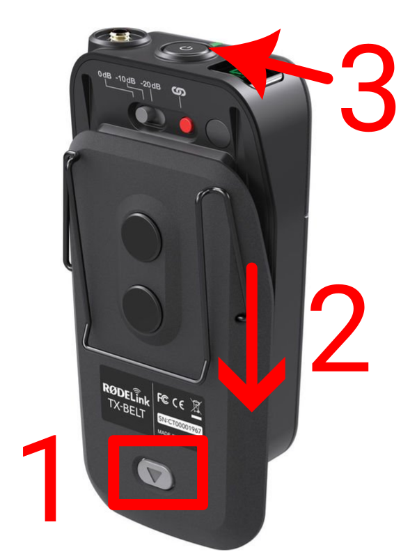

<h1>TASKS ON A SERVICE</h1>

----

<h2>Table of contents</h2>

<!-- TOC -->
* [Prepare for the service](#prepare-for-the-service)
  * [Align the pulpit microphone](#align-the-pulpit-microphone)
  * [Align the pulpit](#align-the-pulpit)
    * [Turn on the coffee-shop TV](#turn-on-the-coffee-shop-tv)
  * [Prepare the headset](#prepare-the-headset)
  * [Rehearsal](#rehearsal)
* [Before the service](#before-the-service)
  * [Playing background music](#playing-background-music)
    * [Playing from the streaming PC](#playing-from-the-streaming-pc)
    * [Enabling the background music](#enabling-the-background-music)
* [During service](#during-service)
  * [During worship](#during-worship)
    * [When someone speaks or prays](#when-someone-speaks-or-prays)
  * [During preaching](#during-preaching)
* [Rule of thumb](#rule-of-thumb)
* [Closing](#closing)
<!-- TOC -->

# Prepare for the service

* Follow the [setting up the system](setup.md) guide.
* Turn on the "Sockets, Screens, Projector" switch.
* Turn on the PC  before 09:50, as automations will start soon after that.
  * **Log in to the PC.**
* You don't need to go through the rehearsal guide again. Definitely don't reset the stage mixers.
* Turn off the stage.

## Align the pulpit microphone

Make sure the pulpit microphone is aligned properly: it should point to the mouth of the speaker.

## Align the pulpit

There is a mark on the floor, align the pulpit to be at the correct position.

### Turn on the coffee-shop TV

 * The remote is dangling around somewhere on the shelf.

## Prepare the headset

1. Above the mixing console, on the shelf you'll find the battery charger.
2. Based on the labels on the charger, select the appropriate set of batteries.
3. The headset should be there too.
4. Press the button on the headset (see image, point #1)
5. While pressing the button, slide down the back side (see image, point #2)
6. Put batteries in
7. Close it back
8. Turn it on by long pressing the button on top (see image, point #3)
    * It should lit up green, displaying 8 on the display.
9. Mute/unmute it as needed by a short(er) press. (It turns red if muted.)
    * Sometimes they ask that you unmute it and they don't need to pay attention.
    * Sometimes they know how to mute it, and they do it.
    * And sometimes they forget to unmute it, then you need to signal them.

If the service starts hours later, you can keep it turned off, and only turn it on before it is given to the preacher.

 

## Rehearsal
Usually there is a small rehearsal before the service, since you are set up from the previous rehearsal, just check that everything is ok.

# Before the service

## Playing background music

You can play background music from two sources, the easiest is the first option.

### Playing from the streaming PC
 1. Open the browser
 2. There is a bookmark called, "BG MUSIC"
 3. Start playing (click on shuffle)

### Enabling the background music

* Unmute **{Mute Groups/"AUX / PC"}** 
* Set the level with **{Groups/"AUX / PC"}** (on the right side)

# During service

## During worship

* Constantly monitor:
    * Did you turn off the preaching mics?
    * Is the volume in a normal range?
    * Do you hear every vocalist & instrument?
    * Do you hear the drum? (From the speakers? Listen for the hi-hats!)
    * Is there any distortion?
    * Is there anything that bothers your ear?
* **PUT YOUR HEAD OUT** to hear what is really going on.

### When someone speaks or prays

* Mute the effects! Having effects on praying or preaching is very cheesy.
* If it's too much to pay attention to, that's all right, then mute the effects once and forget it:)

## During preaching

* Constantly monitor:
    * Is the stage turned off?
    * Only the right microphone is on? (pulpit **OR** headset, never both)
    * The volume is correct?
    * Is there any distortion?

# Rule of thumb

* Always make sure to mute/unmute the right combination of STAGE / PULPIT / HEADSET.
* Only **ONE of those three** should be unmuted at a time.

| When          | Pulpit | Headset | Stage |
|:--------------|:-------|:--------|:------|
| Announcements | ON     | Muted*  | OFF   |
| Worship       | Muted  | Muted   | ON    |
| Preaching**   | Muted  | ON      | OFF   |

* *: If the person who is doing the announcements has the headset then switch to it.
* **: If the headset doesn't work, or stops to work, then switch to pulpit.

# Closing

* Turn off the coffee shop TV.

* Restore all custom changes on the stage, if you made any.

* SPL METER: Put it back onto the shelf above the console.

* Headset:
    * Take out the batteries and put them back into the charger, to the same spot they were in.
    * Put the headset back to the shelf above the console too.

* Wait for the recordings to upload.

  **If you can**, please wait about 15 minutes to pass between the end of the live-streaming, and turning off the PC.
  The computer automatically uploads the recordings of this event, so that our crew could edit/upload/manage it.

  You can check on the status by clicking on the:
  **System tray → Google Drive icon**, and verifying that a file with today's date is being/was uploaded.

   

* Follow the "[Turning off the audio system](../labels/turningoff.pdf)" guide posted on the mixer door.
