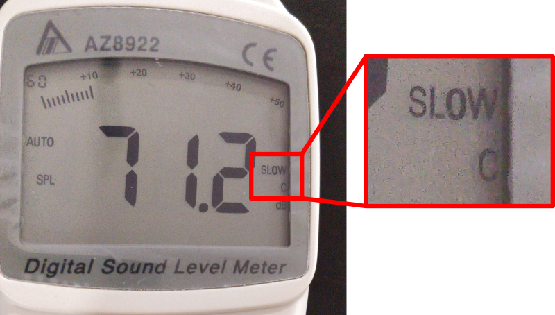

<h1>SETTING UP THE SYSTEM</h1>

<!-- TOC -->
* [At the console](#at-the-console)
  * [Load the appropriate scene](#load-the-appropriate-scene)
    * [Determine the appropriate scene to load:](#determine-the-appropriate-scene-to-load)
    * [Loading the scene](#loading-the-scene)
  * [Other things](#other-things)
  * [Set up the sound pressure level (SPL) meter](#set-up-the-sound-pressure-level-spl-meter)
  * [Prepare the headset](#prepare-the-headset)
* [Verify main speakers' settings](#verify-main-speakers-settings)
  * [Front speakers](#front-speakers)
  * [Fill speakers](#fill-speakers)
* [Align the pulpit](#align-the-pulpit)
* [Reset the stage](#reset-the-stage)
  * [Resetting the stage mixers](#resetting-the-stage-mixers)
  * [Verify stage monitor settings & connections](#verify-stage-monitor-settings--connections)
    * [Left stage monitor](#left-stage-monitor)
    * [Middle stage monitor](#middle-stage-monitor)
    * [Right stage monitor](#right-stage-monitor)
  * [Check that everything is working](#check-that-everything-is-working)
  * [Troubleshooting](#troubleshooting)
    * [Common failures](#common-failures)
    * [Stage mixer connection](#stage-mixer-connection)
    * [Verify keyboard connection](#verify-keyboard-connection)
<!-- TOC -->

# At the console

* Follow the "[Turning on the audio system](../labels/turningon.pdf)" guide posted on the mixer door.

## Load the appropriate scene

### Determine the appropriate scene to load:
  * If this is a rehearsal: **CCP Service READONLY**
    * This contains our default settings, please never overwrite it.
  * If this is the service: **CCP Service**
    * This is the one you saved on the rehearsal.

### Loading the scene

* Press **VIEW** at the "Scenes" section of the mixer.
* By **turning the "GO"** knob, scroll to the "CCP Service READONLY".
* **Press** the "GO" knob to load it.
* **Press** the "Confirm" knob.

## Other things

* [Turn on the stage](notes_on_the_console.md#muting-the-stage), if you will use it.
* Set the Main fader to 0.

## Set up the sound pressure level (SPL) meter

This device measures the volume (lets say) in the room, and it is located on the shelf above the console.

* It is powered by an adapter, turn on the socket for the adapter.
* Turn it on following the handwritten numbers on the buttons.
    * The two button marked "1"(one) need to be pressed together, until the "**n**" shows up on the screen.
    * Then wait until it finishes the initialization.
    * Then press the button marked as 2.
    * Then press the button marked as 3.
* It should read "SLOW" and "C", as on the image.
* Put it to the counter and watch it always.
 

## Prepare the headset

Only do this, if the headset will be used, e.g. if there will be preaching.

* Above the mixing console, on the shelf you'll find the battery charger.
* Based on the labels on the charger, select the appropriate set of batteries.
* The headset should be there too.
* Press the button on the headset (see image, point #1)
* While pressing the button, slide down the back side (see image, point #2)
* Put batteries in
* Close it back
* Turn it on by long pressing the button on top (see image, point #3)
    * It should lit up green, displaying 8 on the display.
* Mute/unmute it as needed by a short(er) press. (It turns red if muted.)
    * Sometimes they ask that you unmute it and they don't need to pay attention.
    * Sometimes they know how to mute it, and they do it.
    * And sometimes they forget to unmute it, then you need to signal them.

If the service starts hours later, you can keep it turned off, and only turn it on before it is given to the preacher.

 

# Verify main speakers' settings

## Front speakers

* Ch 2 Level at **9 o'clock**
* DSP D-contour **OFF**
* DSP HPF **OFF**
* Gray button **NOT** pressed in

 

## Fill speakers

* Level at 9 o'clock
* High at 0
* Low at 0

 

# Align the pulpit

There is a mark on the floor, align the pulpit to be at the correct position.

# Reset the stage

## Resetting the stage mixers

Reset the stage mixers, but only **BEFORE** a rehearsal. (So don't do it before a service, when they already set it up
for themselves on the rehearsal.)

There is one mixer in the drum-room too, reset that one also.

The order is important here:

1. Turn it on, if it's not on (switch is on the back side)
2. Reset the top-knobs as follows (and also on the image):
    * Equalizers section knobs (first four): **12 o'clock**
    * Limiter to **MAX**
    * Level to **3 o'clock**
3. Recall preset 16:
    * Press and hold **RECALL**
    * Press **16**
    * **Release** RECALL

 

## Verify stage monitor settings & connections

### Left stage monitor

* All 12 o'clock.
* Check power and signal cable connections, sometimes they become loose.

 

### Middle stage monitor

* All 12 o'clock.
* Check power and signal cable connections, sometimes they become loose.

 

### Right stage monitor

* This one is a bit damaged, the level should be at 3 o'clock!
* Check power and signal cable connections, sometimes they become loose.

 

## Check that everything is working

* Turn on the keyboard, and press one of the keys, you should hear it, from all monitors.

* Speak into each microphone, and you should see activity on the mixer, and hear yourself in each monitor.

If everything was working, continue with the [Rehearsal guide](rehearsal.md) or the [Service guide](service.md)!

If something wasn't working, check the rest of this guide on how to troubleshoot.

## Troubleshooting

If there is any issue on the stage, check these things:

### Common failures

No signal activity on the mics?

* The stage is off (on the console), that's why no microphone is working.
* The individual microphone is muted on the console.
* The stage mixer isn't on.

There is signal indication, but inaudible?

* A power or signal cable slipped out from the monitor.
* The stage mixer is disconnected.
* The limiter knob is turned down.

### Stage mixer connection

Verify that the speakers are connected to **L/MONO**:

### Verify keyboard connection

Verify that it is connected properly, sometimes they unplug it for practicing.

