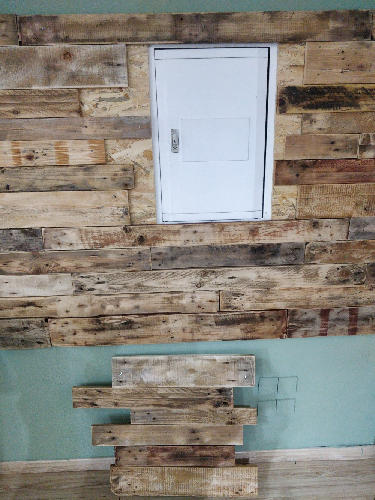
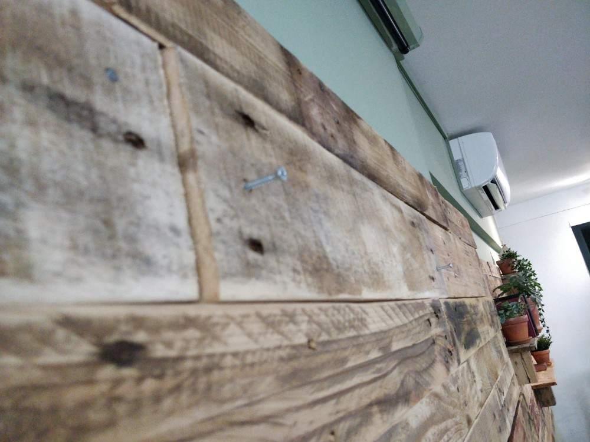
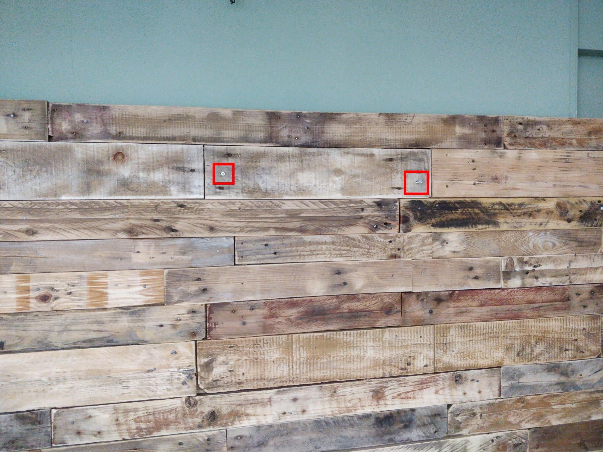
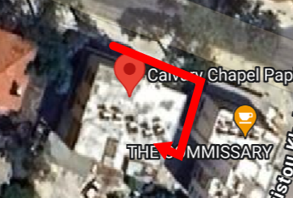
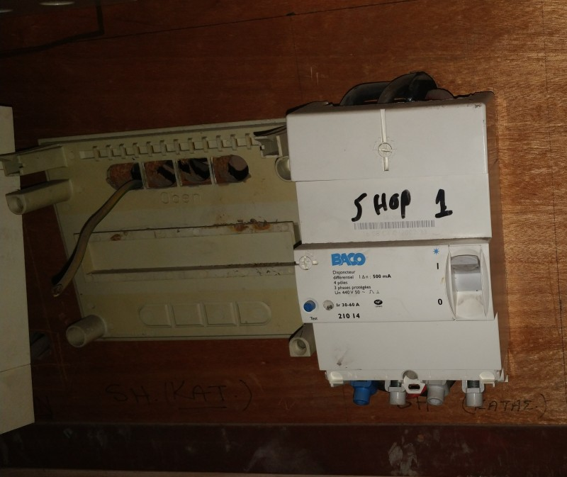
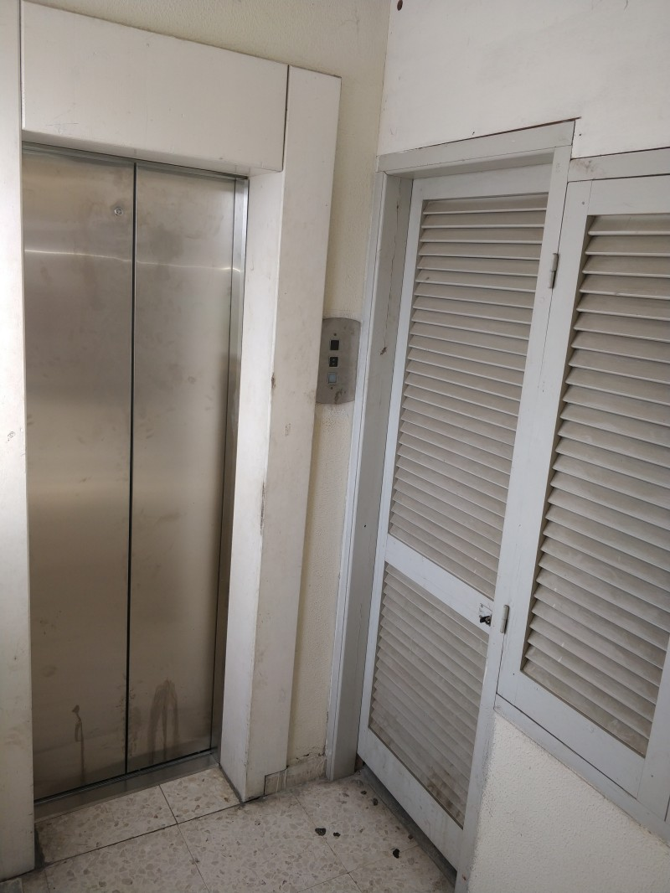
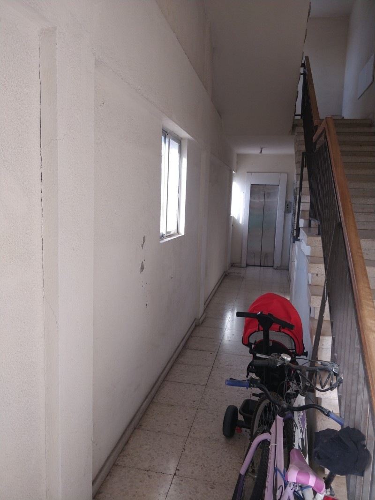
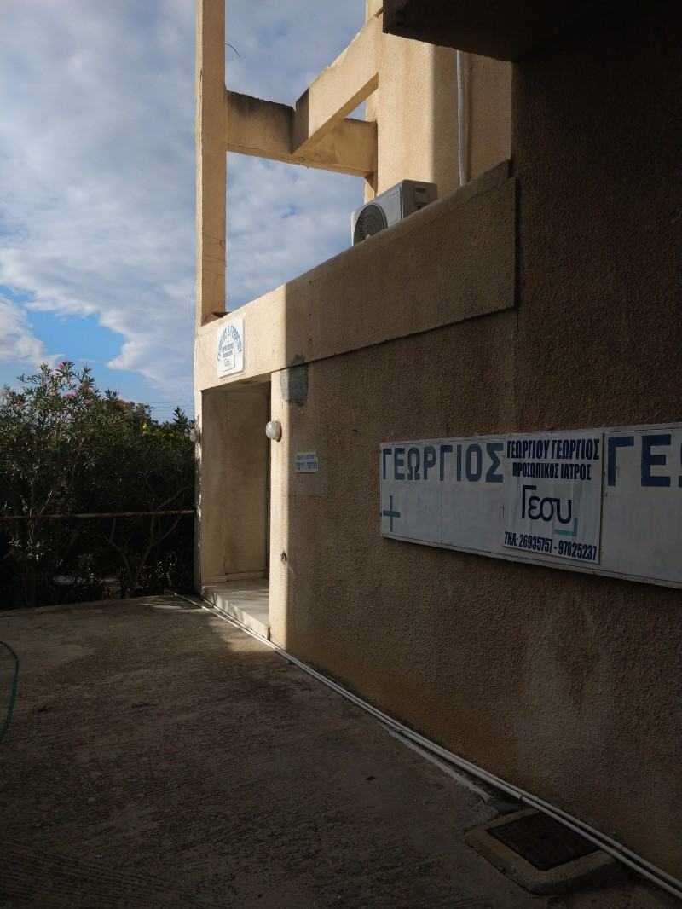
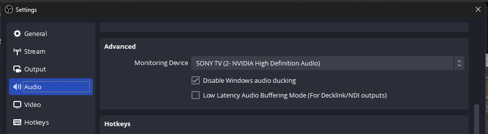

<h1>TROUBLESHOOTING</h1>

----

<h2>Table of contents</h2>

<!-- TOC -->
* [Baby room TV doesn't work](#baby-room-tv-doesnt-work)
  * [No signal](#no-signal)
  * [The page can not be found](#the-page-can-not-be-found-)
  * [What URL?](#what-url)
* [Camera](#camera)
  * [The projector's image has rolling lines](#the-projectors-image-has-rolling-lines)
* [Projector](#projector)
  * [Nothing shows up](#nothing-shows-up)
  * [Colors are wrong](#colors-are-wrong)
* [OBS](#obs)
  * [The "PROJECTION" image is stuck, not updating in OBS](#the-projection-image-is-stuck-not-updating-in-obs)
  * [No image from the camera](#no-image-from-the-camera)
  * [No audio input coming to OBS](#no-audio-input-coming-to-obs)
  * [No audio in the office TV](#no-audio-in-the-office-tv)
* [Streaming](#streaming)
  * [Stream is not going live](#stream-is-not-going-live)
  * [Restarting the stream on one of the platforms](#restarting-the-stream-on-one-of-the-platforms)
    * [(Re)starting the YouTube stream](#restarting-the-youtube-stream)
    * [(Re)starting the Facebook stream](#restarting-the-facebook-stream)
    * [Restarting just one platform's stream](#restarting-just-one-platforms-stream)
<!-- TOC -->

# Baby room TV doesn't work
## No signal
 * That TV only gets signal when the stream is going in OBS.

## The page can not be found 
 * After turning on, the TV needs a minute to connect to the internet, just wait a bit and retry.
 * Make sure the "Network" socket is turned on.

## What URL?
If for any reason the TV forgets the URL it needs to load, load this url:
https://tinyurl.com/tvstreamtest1

# Electricity is GONE!?
# There are three main boxes:
 * Behind the projector screen (main room, upstairs things)
 * Kitchen (mostly just kitchen stuff is switched from here)
 * Main switch outside

If the lights in the kitchen still works, you need to check behind the projector screen. Otherwise probably the main switch tripped.

## Behind the projector screen

Sadly, currently you need to unscrew two screws to get the panel off.
You can find a screwdriver in the storage area next to the book-gardrobe, behind the door.

 

## Main switch
You need to go outside of the building:

 

 

# Camera
## The projector's image has rolling lines
 * You must set the projection device's refresh rate to 50HZ.
 * See more on this at [projector/Colors are wrong](#colors-are-wrong).

# Projector

## Nothing shows up

* Make sure the HDMI cable is properly connected
* If applicable, make sure the one HDMI that is coming from the pulpit is looped in the audio cave to the "TO PROJECTOR"
  HDMI.
* Make sure the right sockets are on:
    * "Screens + Sockets + Projector"
    * "PC + OTHERS"

## Colors are wrong

Make sure **all** the following statements hold true:

* The refresh rate is set to 50HZ on the PC that is doing the projection.
    * Search online for "[Setting display refresh rate on YOUR_OPERATING_SYSTEM_AND_ITS_VERSION](https://duckduckgo.com/?t=ffab&q=Setting+display+refresh+rate+on+YOUR_OPERATING_SYSTEM_AND_ITS_VERSION%22&ia=web)"
    * Make sure to replace your operating system's name (E.g.: Windows) and version (e.g.: 11)
* If the projecting PC is a MAC:
    * Turn off "TRUE TONE"
    * Select the right color profile: "sRGB-IEC..." for the extended display.
* The projector's image mode is sRGB
    * Use the remote control, press the "MODE" button and select sRGB.

# OBS

## The "PROJECTION" image is stuck, not updating in OBS

In OBS:

* Select the "_ Notebook + Cam" scene.
* Right-click on the "Notebook" source, select "Properties".
* Press deactivate, then activate.

## No image from the camera

Make sure you have turned all the required sockets on, especially these:

 * "Main speakers"
 * "Screens + Sockets + Projector"
 * "Network"

You might need to restart OBS to re-try opening the camera.

## No audio input coming to OBS

If you see, that there is no audio coming to OBS:

Sometimes the audio input device in OBS is reset to something else, than LINE IN.

1. Click on the audio input's three dots (the one that is the highest)
2. Select Properties
3. Select LINE IN
4. Press OK

## No audio in the office TV

* Open OBS Settings
* Audio section
* Advanced
* The "monitoring device" should be "SONY TV (2- NVIDIA High Definition Audio)"

# Streaming

## Stream is not going live

* Make sure OBS is streaming (when the button says "STOP STREAM")
* Check if the streams are enabled in restreamer: (
  see [Restarting just one platform's stream](#restarting-just-one-platforms-stream))
* If nothing else, then manually restart the streams as seen
  in [Restarting the stream on one of the platforms](#restarting-the-stream-on-one-of-the-platforms).

## Restarting the stream on one of the platforms

### (Re)starting the YouTube stream

* Open the browser on the PC
* Click on the "Youtube LIVE" bookmark
* After this, proceed to [Restarting just one platform's stream](#restarting-just-one-platforms-stream)
* Restart youtube's stream as shown there
* Come back to the youtube live page, and press the go LIVE button.

### (Re)starting the Facebook stream

1. Open the browser on the PC
2. Click on the "FB: GO LIVE" bookmark
3. Click on the "GO LIVE" button

   Edit the post's details:

    

   Type in the title and description (required):

    

4. After this, proceed to [Restarting just one platform's stream](#restarting-just-one-platforms-stream), restart the facebook stream, and then come
   back to here.
5. Now press Go Live on facebook:

### Restarting just one platform's stream

* Open up the browser
* Press the "RESTREAMER" bookmark on the bookmarks toolbar
* Log in (the user/pass is saved into the browser)
* Turn off one off the problematic source, and turn it back on, that will reconnect the stream.

