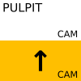
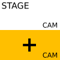

# STREAM lifecycle on Sundays
### 10:01
It will automatically start to stream with the "SERVICE PRE-STREAM" scene.
This helps people to tune in, check audio and video settings, etc.

The "TOGGLE" button does not work during this.

### 10:30  
It will automatically switch to the "PULPIT" scene, and starts the recording.

### DURING the service

Use the  button to toggle between the camera and the presentation.

#### Changing camera angles
* Press any of these once:
  
  
  
  

* Press  together with   to transition to live.

#### Manual camera adjustment
To manually move or zoom the camera:

* Press & hold 
* Press any of these to move: ←, ↑, →, ↓
* Press any of these to zoom:+, -

### AFTER the end, after the blessing, on "AMEN"

* Press .

* Press  together with   to transition to live.
 
* This will stop the recording and the live stream also.

