<h1>DOING A LIVE STREAM</h1>
<hr>
THIS DOCUMENT IS DEPRECATED ALREADY, IT IS WORK IN PROGRESS.

<!-- TOC -->
* [Turn on all the TVs](#turn-on-all-the-tvs)
  * [Coffee shop screen](#coffee-shop-screen)
  * [Pole screen](#pole-screen)
* [Turning on the PC](#turning-on-the-pc)
* [Setting up the stream](#setting-up-the-stream)
  * [Facebook Live](#facebook-live)
* [Start OBS](#start-obs)
* [Verify audio settings](#verify-audio-settings)
* [Managing the camera](#managing-the-camera)
* [Start streaming in OBS](#start-streaming-in-obs)
* [Start streaming in Facebook](#start-streaming-in-facebook)
* [Lifecycle of streaming and things to pay attention during service](#lifecycle-of-streaming-and-things-to-pay-attention-during-service)
* [Verifying stream](#verifying-stream-)
  * [OBS](#obs-)
  * [Facebook](#facebook)
<!-- TOC -->

# Turn on all the TVs
## Coffee shop screen
 * Pull it out to face the audience.
 * The button is in the bottom center.

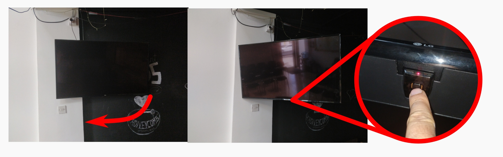

## Pole screen

With the remote:

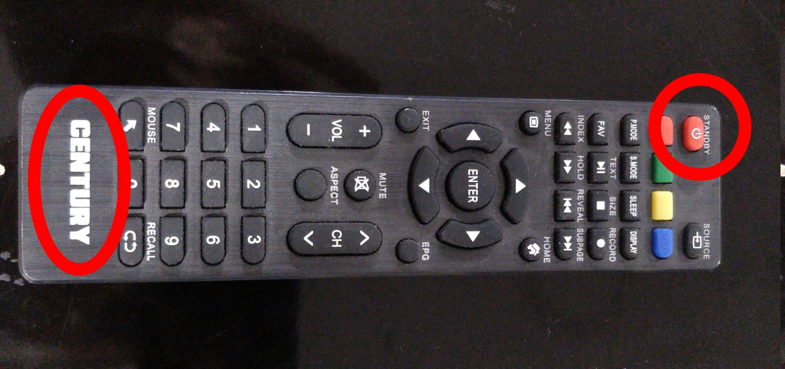

Or manually:

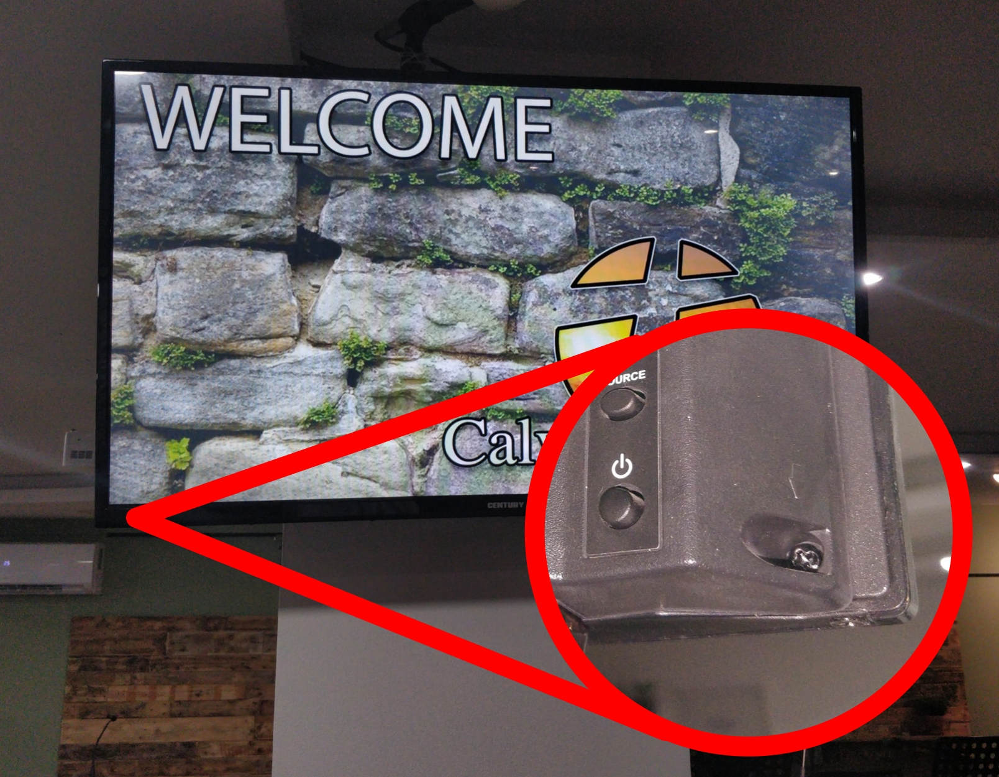


# Turning on the PC
Make sure to have the following sockets turned on:

Screens

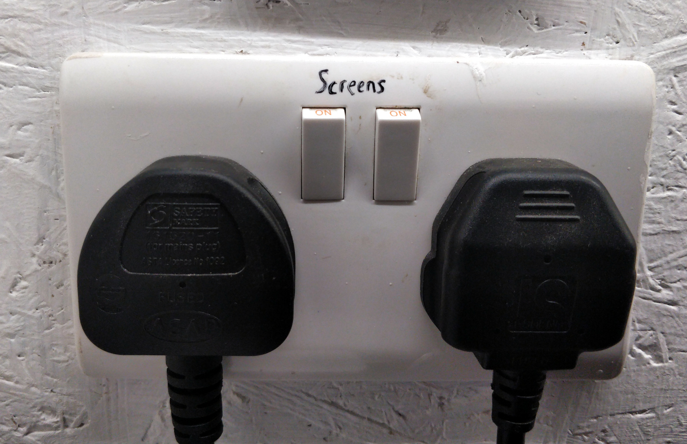

Networking

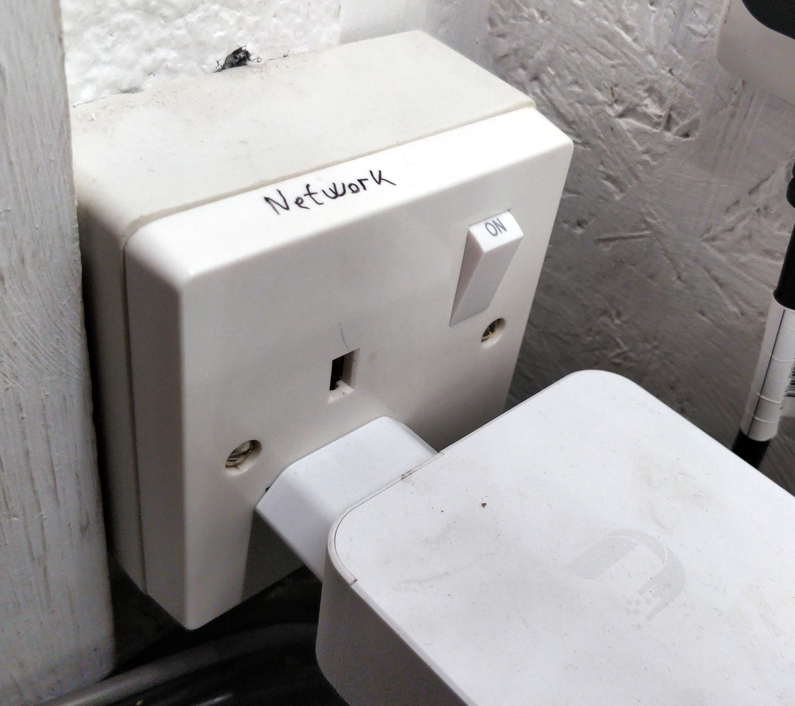


PC+Others:


Turn on the PC:


# Setting up the stream
## Facebook Live
Start Google Chrome:

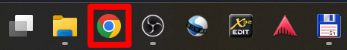

Click on the "FB: GO LIVE" bookmark:

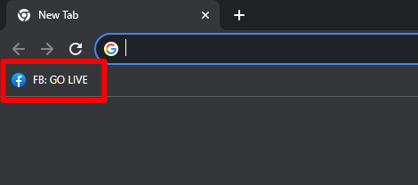

Click on the "GO LIVE" button:

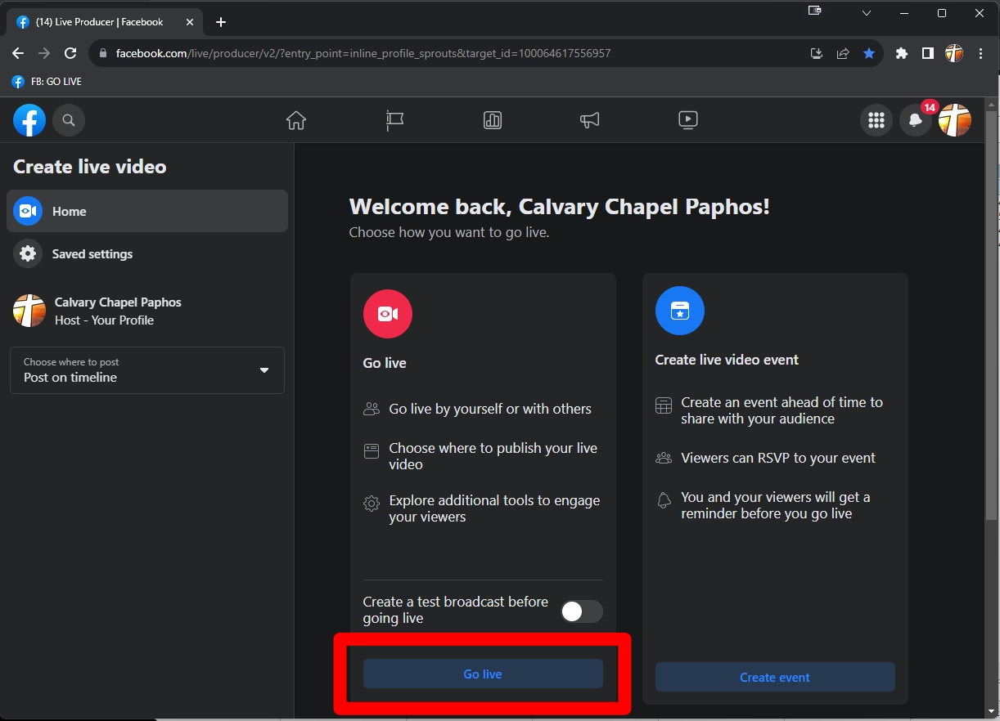

Edit the post's details:

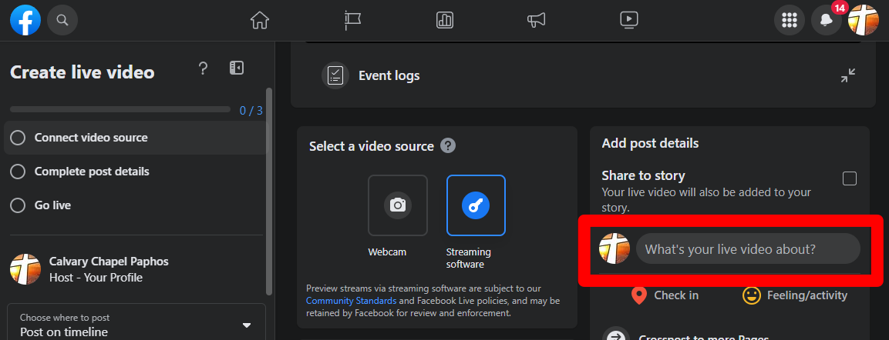

Type in the title and description:

 * For title, we use the format "Title of Sermon - Main Passage - Full name of Pastor"
 * For description, you must write something as it will not let you stream otherwise. Usually we write "Good morning church!"

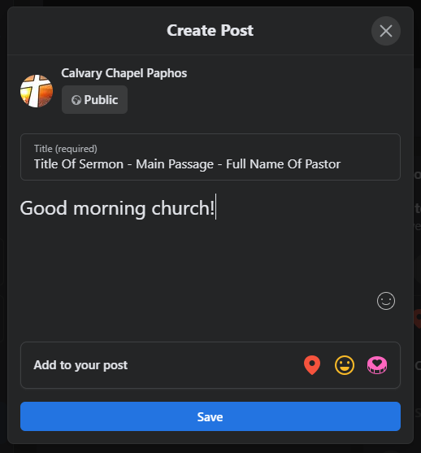


# Start OBS

Start OBS:

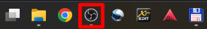

# Verify audio settings
 * Mic/Aux should be unmuted
 * Desktop Audio 2 should be muted
 * Upon any signal from the console, Mic/Aux should show signal
 * Desktop Audio 2 might not show a signal in the beginning. Unmute and then mute again if the signal passes through.

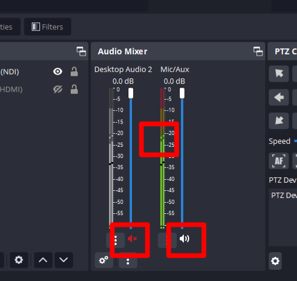

# Managing the camera
 * Click on the first/only element in the list "PTZ DEVICE"
 * Double click any of the presets, to point the camera

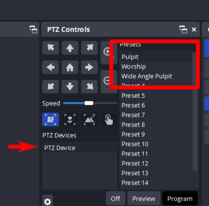

# Start streaming in OBS
 * Make sure there is no audio coming from the console (mute headset, pulpit and turn stage off)
 * Press "Start streaming"


# Start streaming in Facebook

2-3 minutes before the service starts, start the stream so that people can start watching.
Make sure there is no audio input yet.

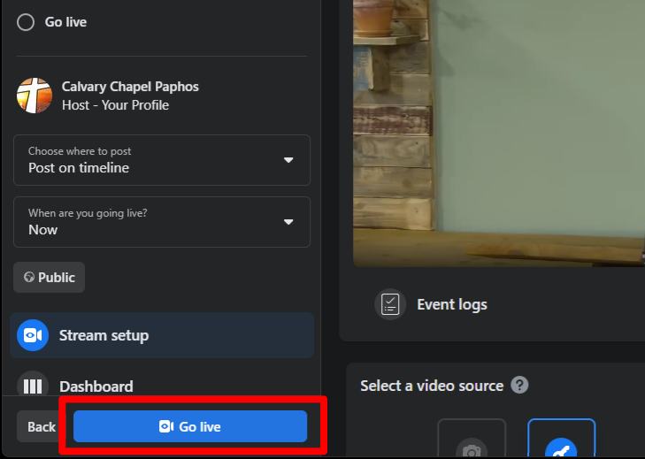


# Lifecycle of streaming and things to pay attention during service
 * 2-3 minutes before the announcements start, start the live streaming
 * Pointing the camera using the presets
 * Verify the stream's health & comments (see below)
 * Stop the **RECORDING** after the pastor proclaims the blessing with the church
 * Stop the **STREAMING** after the pastor dismisses the church

# Verifying stream 
## OBS 
Bottom right of OBS:

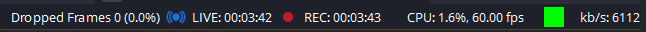

It should look like this:

* Green indicator
* CPU < 30%
* FPS: 60
* Dropped frames: 0 (a few is fine, if it is going up constantly, then we have an issue)

## Facebook
The metrics should be kind-of flat, without big dips in it:

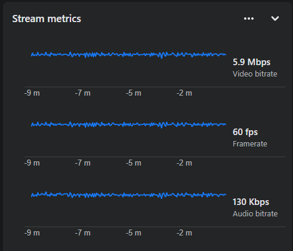

Also you want to check on the comments, if something very bad would come up, you can delete it.
If in doubt, consult an elder/leader about it.


# FAcebook scheduling:
 * Event name: Church Service
 * Press Recurring event
    * Weekly
    * sundays
    * From 10:00 AM
    * To 12:00PM
    * Start date next sunday
    * End date: bit more than half year ahead (depending on how much it lets you to set)


 * Description:
```
The real service will start at 10:30 AM, the live stream starts 30 min earlier so that you could tune in on time.

You can find the live stream at:
https://facebook.com/100064617556957/live_videos

We also stream to YouTube:
https://youtube.com/@calvarychapelpaphos6683/streams

Join us in real life, or through the live stream!
```

 * Settings -> Stream -> Use persistent stream key (!!!)
 * Set up live video
 * Select software
 * Select automatically start stream
 * Press save