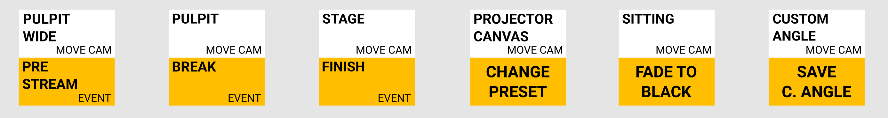
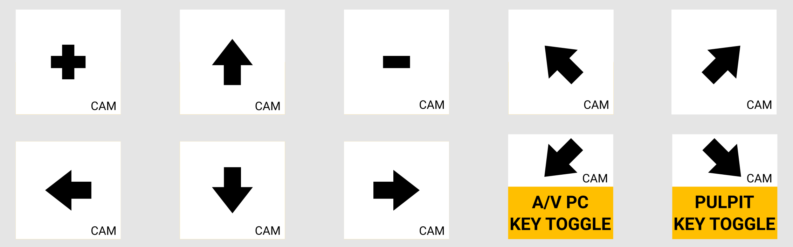

# STREAM lifecycle on Sundays
### 10:00
It will automatically start to stream with the "SERVICE PRE-STREAM" scene.
This helps people to tune in, check audio and video settings, etc.

The "TOGGLE" button does not work during this.

### 10:30  
It will automatically turn the camera to the PULPIT, and the event begins.

### DURING the service

 * Use the  button to toggle between the camera and the presentation.
 * Use the  button to toggle between the camera and the pulpit PC.
 * Use the  button to toggle between the camera and the pc's screen in the audio booth.

Or:
 * Use the  button to show the camera at any time.
 * Use the  to show the general background.

# Optional camera management
## Changing camera angles
If you ever need to change the camera angle, then press any of these once, to reload camera positions:

## Manual camera adjustment
To manually move or zoom the camera, press any of these:

### AFTER the end, after the blessing, on "AMEN"

* Press **FN** + **FINISH** ( + )

* This will end the recording and streaming after some delay.

* After all that the generic background will be shown on screens. If the service needs continuation, then just press , and everything can continue (without recording or streaming).

