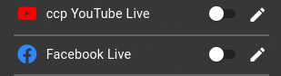

<h1>DOING THE LIVE STREAM</h1>

<!-- TOC -->
* [Console first!](#console-first)
* [Turning on the sockets](#turning-on-the-sockets)
* [Turn on the PC:](#turn-on-the-pc)
* [Turn on all the TVs](#turn-on-all-the-tvs)
  * [Screen on the pole](#screen-on-the-pole)
  * [Coffee shop screen](#coffee-shop-screen)
* [About the STREAM lifecycle on sundays](#about-the-stream-lifecycle-on-sundays)
* [Troubleshooting](#troubleshooting)
  * [No audio input coming to OBS](#no-audio-input-coming-to-obs)
  * [No audio in the office TV](#no-audio-in-the-office-tv)
  * [Restarting the stream on one of the platforms](#restarting-the-stream-on-one-of-the-platforms)
    * [About our YouTube stream](#about-our-youtube-stream)
      * [Restarting the YouTube stream](#restarting-the-youtube-stream)
    * [About our Facebook stream](#about-our-facebook-stream)
      * [Restarting the Facebook stream](#restarting-the-facebook-stream)
    * [Restarting just one platform's stream](#restarting-just-one-platforms-stream)
<!-- TOC -->

# Console first!

The console must be turned on first (see [turning on the audio system guide](../labels/turningon.pdf)),
so if you got there first, then just turn on the Mixer first with the socket, and then proceed.

# Turning on the sockets

Make sure to have the sockets with the following labels turned on:

1. Screens, projector, sockets:
1. Screens
1. Networking
1. PC+Others (it is below the shelf above the console)

# Turn on the PC:

The power button is on the top:

# Turn on all the TVs

## Screen on the pole

Use the remote control labeled "CENTURY", it is above the console on the shelf usually:

## Coffee shop screen

* Pull it out to face the audience.
* The button is in the bottom center.

# About the STREAM lifecycle on sundays

* 10:01: It will start to stream automatically with the "PRE-STREAM" scene
    * This helps people to tune in, check audio and video settings, etc.
* 10:30: It will switch to the "PULPIT" scene, turn the camera there and hide the projector input, unmute the input,
  start recording, etc.
    * This is when the announcements, and the service starts.
* Camera movements: the camera will move based on the audio technician's handling of the mute status of the
  stage/pulpit.
    * If the headset is unmuted OR the pulpit is unmuted, OR the stage is muted: camera pans to pulpit
    * If the headset is muted AND the pulpit is muted, AND the stage is unmuted: camera pans to stage
* 12:10: The end-of-stream scene will become active on the preview side only.
    * At the end of the service, after our blessing, someone should make this scene active.
    * Making this scene active will stop the recording and the live stream also.

# Troubleshooting

## No audio input coming to OBS

If you see, that there is no audio coming to OBS:

Sometimes the audio input device in OBS is reset to something else, than LINE IN.

1. Click on the audio input's three dots (the one that is the highest)
1. Select Properties
1. Select LINE IN
1. Press OK

## No audio in the office TV

* Open OBS Settings
* Audio section
* Advanced
* The "monitoring device" should be "SONY TV (2- NVIDIA High Definition Audio)"

## Restarting the stream on one of the platforms

### About our YouTube stream

* Our OBS is scripted, so when the OBS live stream starts, it (OBS) executes a command that automatically
  starts a new live event on YouTube.
* So if you stop streaming, then re-start, then it will automatically restart youtube also.
* But you might not want to stop streaming, as it will break other platforms that might be still going, e.g. facebook.

#### Restarting the YouTube stream

* In this case, you need to manually start again the youtube live stream:
    * Open the browser on the PC
    * Click on the "Youtube LIVE" bookmark
    * After this, proceed to [Re-starting just one platform's stream](#restarting-just-one-platforms-stream)
    * Restart youtube's stream as shown there
    * Come back to the youtube live page, and press the go LIVE button.

### About our Facebook stream

* Facebook can't be auto-started, but events can be created in advance, and they can be set as recurring.
* So for some of our events, facebook live is pre-scheduled for a half year or so.
* This means, that if we start to stream at the right (scheduled) time, facebook is going live automatically.
* But if the stream fails, that scheduled event will stop, and if you want to re-start it you have to initiate a
  facebook live event manually.

#### Restarting the Facebook stream

* Open the browser on the PC
* Click on the "FB: GO LIVE" bookmark
* Click on the "GO LIVE" button

Edit the post's details:

Type in the title and description:

* For title, we use the format "Title of Sermon - Main Passage - Full name of Pastor",
* But if you are in a hurry, go with "Church Service", someone will rename it later on.
* For description, you must write something as it will not let you stream otherwise. Usually we write "Good morning
  church!"

* After this, proceed to [Re-starting just one platform's stream](#restarting-just-one-platforms-stream), and then come
  back to here.
* Restart facebook's stream
* Now press Go Live on facebook:

### Restarting just one platform's stream

* Open up the browser
* Press the "RESTREAMER" bookmark on the bookmarks toolbar
* Log in (the user/pass is saved into the browser)
* Turn off one off the problematic source, and turn it back on, that will reconnect the stream.

