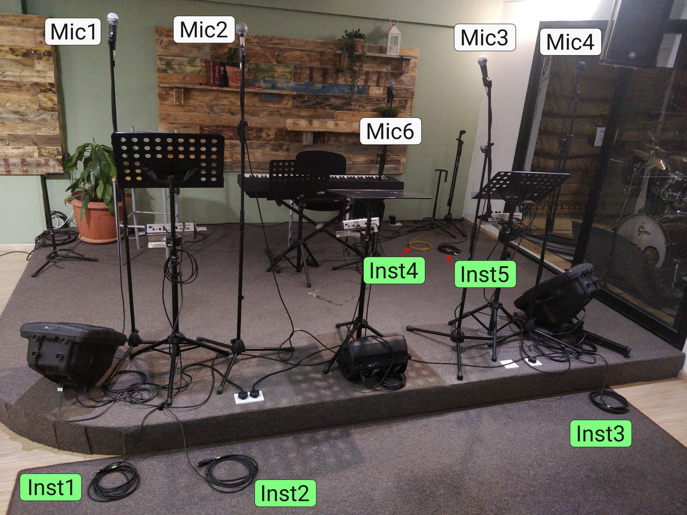

# Audio related help for worship team members

## In Ear Monitoring
### Benefits
In-ear-monitoring is a technique where the musicians hear themselves and parts of the band through their headphones/in-ear-monitoring headsets.
By using IEM:
- Each musician can decide his/her own mix, to whom to listen and how much.
- Each musician can set their own comfortable level of themselves: hearing our own "output" is crucial in order to have proper feedback which is a requirement of staying in tune, harmony, etc.
- The noise from the stage isn't interfering as much, e.g. the loud drums or instruments around become more like a background noise, and not something that is bothering and needs concentration to filter out.
- The stage becomes essentially quiet, or as quiet as it can be. The stage monitors would add to the "room noise".
Ideally the audience should only hear the properly mixed and balanced and composed main mix from the room speakers. Everything else, like the stage monitor speakers (not optimized mix, echoing from the wall, etc) just adds noise that is unpleasant and unwanted.
Ultimately we all serve the people, and we should strive to get the best quality we can achieve, and this is a huge step in this direction.

This is how our stage mixers work:

 * [Stage mixer 101](https://youtu.be/gHtO91dybpI)

And this is generally how you want to set it up for yourself:
    
(This guy uses a different stage mixer, but you'll get the idea.)

 * Mixing In Ear Monitors - Musician Edition: https://yout.be/watch?v=JKQtMS_TjP8
 * In-Ear Monitors for Singers: https://youtu.be/watch?v=rA7LNWSs_LQ

## For Drummers
* [How does the drum room stage-talkback work?](https://youtu.be/nelw-jKgT6w)
    * EDIT: It is enabled always and you can use it.

## Cable & microphone numbering on the stage

The logic is, that:
 * Close to **Mic1** is now **Inst1** and **Inst2** cables.
 * Close to **Mic3** is the **Inst3** cable.
 * And the stage corner has **Inst4** and **Inst5** cables.

### Drinks
Please use sealed containers to avoid water splashing on the stage. Water and electricity doesn't mix well.
