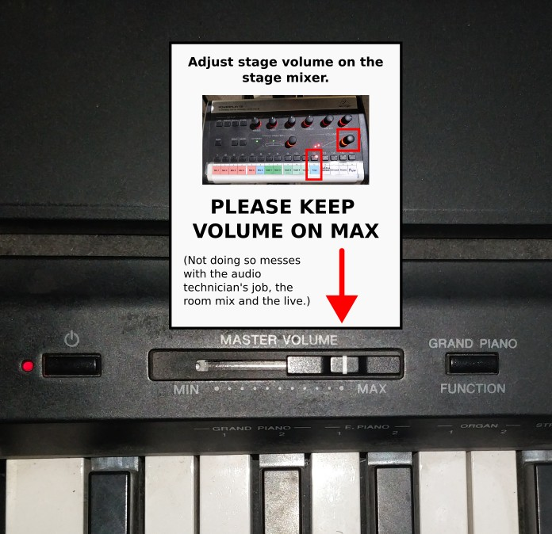

# Audio related help for worship team members

## Videos
 * [How does the stage mixer work?](https://youtu.be/nRDQFHH9zpU)
 * [How does the drum room stage-talkback work?](https://youtu.be/nelw-jKgT6w)

## Cable & microphone numbering on the stage

The logic is, that:
 * Close to **Mic1** is now **Inst1** and **Inst2** cables.
 * Close to **Mic3** is the **Inst3** cable.
 * And the stage corner has **Inst4** and **Inst5** cables.

## Other things
### Drinks

Please use sealed containers to avoid water splashing on the stage. Water and electricity doesn't mix well.

### Keyboard volume

Please keep the keyboard volume on max while rehearsing or performing.

If you need to change the volume, change it on the stage mixer.

You might pull it down while changing presets on the keyboard to avoid the beeping, but then put it back to max please.

