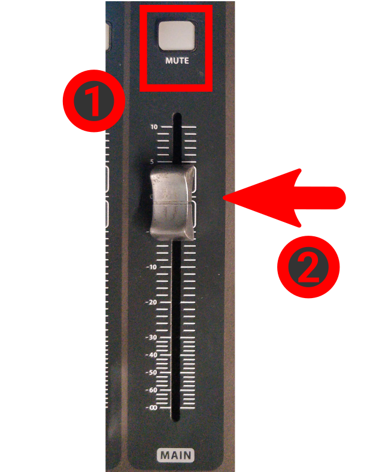
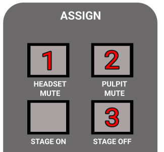
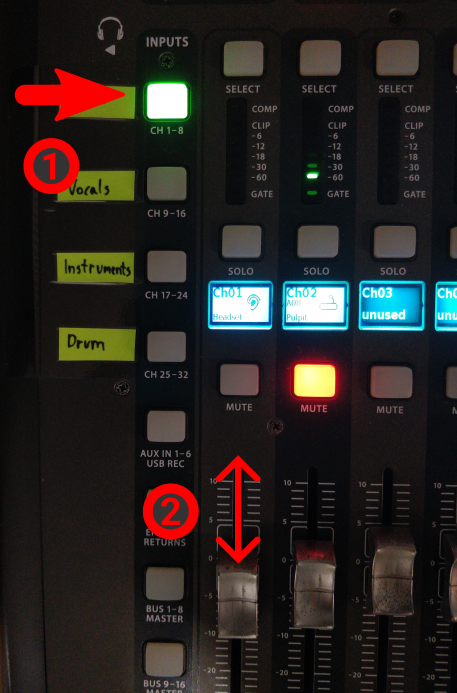

<h1>HOW TO DO A/V FOR BIBLESCHOOL</h1>

<!-- TOC -->
* [Turning on](#turning-on)
* [Setup](#setup)
* [Configure Console](#configure-console)
* [Prepare for going live](#prepare-for-going-live)
<!-- TOC -->

# Turning on
1. Follow the [Turning on the audio system](../turningon.pdf) guide.
    1. You may skip the "coffee shop" step, if you don't have people there.

1. Turn on the following sockets/switches:
    * "PC + OTHERS"
    * "Network"
    * "Screens"
    * "Screens + Sockets + Projector"

1. Move the pulpit to the marked position on the floor, or put the chair on the marked position.

1. Turn on the projector & bring down the projection-screen.

1. Turn on the TV on the pole, with the remote control, that is labeled "CENTURY"

1. Turn on the TV in the coffee shop too, if needed.

# Setup

1. Connect the "**FROM PULPIT**" HDMI cable with the extender to the "**TO PROJECTOR**" cable.

1. Put the little keyboard (with 4 buttons) outside the audio cave, where the person managing it (may be you:)) will
   sit. It is on a long extension cable for this reason.
    1. Use the "Cam. Toggle" button on it, to switch between the camera and the slides.

1. Put batteries into the headset
    1. Based on the day, select the right pair of batteries
    2. Push the button at the back of the headset and while pushing, slide down the backplate.
    3. Put in batteries, close back.
    4. Long press the single button at the top to turn it on.

    

# Configure the console
1. Load the CCP SERVICE READONLY scene in the console
    1. Press VIEW at the "SCENES" section
    2. Rotate the first knob under the display (labeled GO) until the selection is on CCP Service READONLY.
    3. Press the first knob (labeled "GO")

1. Set up the MAIN bus.
    1. Mute button should not be red.
    2. Set Main fader to 0 (thats not the lowest position)

     

1. Find the "ASSIGN" section on the mixer, on the right side.
    1. Make the "**HEADSET MUTE**" button **UNLIT**/GRAY, by pressing it if needed.
    2. Make the "**PULPIT MUTE**" **LIT** by pressing it if needed.
    3. Press "**STAGE OFF**": it will not light up, just press it once.
        1. Press the "CONFIRM" knob on the display.

     
     
     

    

1. Set the headset volume properly
    * Select the "SPEAKER" layer
    * Move the first, "HEADSET" channel's fader up and down as needed.

     
     

    

# Prepare for going live
1. Turn on the PC
    1. The power button is on the top of the PC.

1. Start apps
    1. Start OBS (should have started on its own)
    2. Select and make live the appropriate "BIBLESCHOOL *" scene.

1. When the class starts, press "START RECORDING" in OBS.

1. When finished:
    1. Press "STOP RECORDING" in OBS.
    2. Turn off the projector.
    3. Close back the projector-screen.
    4. Put back the little keyboard.
    5. Get the headset batteries out and put them back into the charger.
    6. Put the headset back to the shelf.
    7. Turn off the computer.
    8. Restore the HDMI cables as they were (unplug, and reconnect the USB grabber)
    9. And finally follow the [Turning off the audio system](../turningoff.pdf) guide.