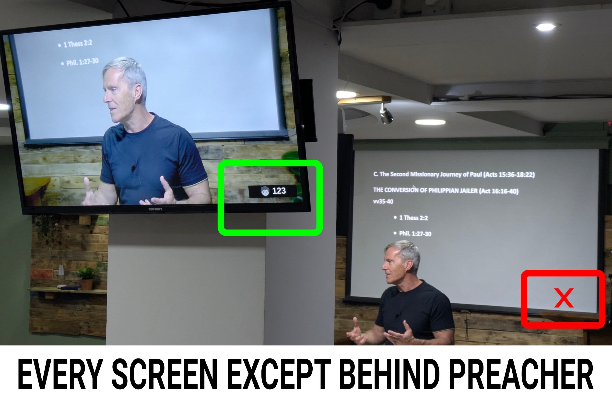

# Nursery Call (for ministers)

## Opening

1. Connect to the **Staff WiFi** network (it only works from this network!)
2. Scan the QR code or open this address:

   

    [https://192.168.2.10/nursery](https://192.168.2.10/nursery)
3. Get through the warning "**This Connection Is Not Private**":
   * Click on "**Show details**" or "Advanced" or "More" 
   * Click on "**Accept**" or "Proceed to ..." or similar.

## Using

The submitted number will be visible on all the screens except behind the preacher.
Make sure to instruct parents to see any of the screens that is not behind the preacher, to notice the call.

