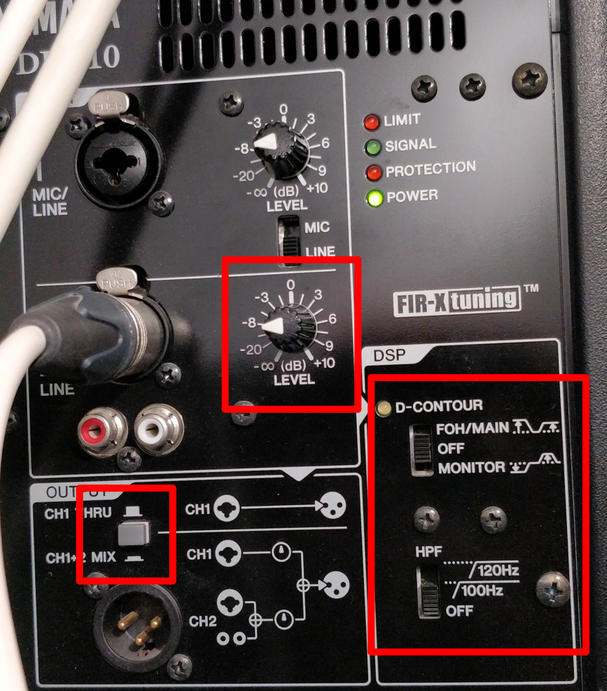

<h1>CONFIGURATION REFERENCE</h1>
----

<h2>Table of contents</h2>

This document is under construction.

<!-- TOC -->
  * [<h1>CONFIGURATION REFERENCE</h1>](#h1configuration-referenceh1)
* [Main speakers' settings](#main-speakers-settings)
  * [Front speakers](#front-speakers)
  * [Fill speakers](#fill-speakers)
  * [Coffee shop speakers](#coffee-shop-speakers)
  * [Rhode link settings](#rhode-link-settings)
* [Hardware](#hardware)
  * [Projector](#projector)
  * [Coffeshop TV (LG)](#coffeshop-tv-lg)
  * [Pole TV (Century)](#pole-tv-century)
  * [PTZ Camera](#ptz-camera)
  * [Baby-room TV](#baby-room-tv)
* [Streaming PC](#streaming-pc)
<!-- TOC -->

# Main speakers' settings

## Front speakers

* Ch 2 Level at **9 o'clock**
* DSP D-contour **OFF**
* DSP HPF **OFF**
* Gray button **NOT** pressed in

 

## Fill speakers

* Level at 9 o'clock
* High at 0
* Low at 0

 

## Coffee shop speakers

* Volume at 9 o'clock
* DSP preset button NOT pressed in

 

## Rhode link settings

* The receiver (the one on the wall) should be on 0db gain.
* The transmitter (the one with the mic) should be on 10db gain.

# Hardware
## Projector
 * Used input: HDMI2 (not HDMI1/MHL)

 * Display
   * Image settings
     * Display mode: sRGB
     * Wall color: Off
     * Brightness: 25
     * Contrast: -4
     * Sharpness: 10
     * Brightness mode: Power 100%
     * Gamma: Standard(2.2)
     * Color settings
       * BrilliantColor 1
       * Color Matching: (defaults, all 0)
       * RGB Gain/Bias: (defaults, all 0)
       * Color space: RGB(0~255)
   * Aspect ratio: 16:9
   * Edge Mask: 0
   * Zoom: 0
 * Setup
   * Direct power on: off
   * Signal power on: off
   * Auto power off (min): 25
   * Power mode (Standby): Eco
   * HDMI Cec: OFF
   * Language: English
   * Auto Source: off
   * Input source: HDMI2
   * High altitude: off
   * Background color: LOGO
 * Network
   * DHCP: ON
   
## Coffeshop TV (LG)
 * Picture
   * Pisture mode settings
     * Picture mode: : Standard (User)
     * Backlight: 100
     * Contrest: 100
     * Brightness: 50
     * Sharpness: 10
     * Colour: 55
     * Tint: 0
     * Colour Temperature: C20
     * Advanced settings: 
       * Gamma: High2
     * Black level: Auto
   * Aspect Ratio Settings: 16:9
   * Energy Saving: Off
 * General
   * Standby Light: on
   * Settings help: on
   * Screen saver: off (**<-VERY IMPORTANT**)
   * No signal image: off (**<-VERY IMPORTANT**)

Important parts are important because otherwise the TV does not remember which input should it use the next time it is turned on.

## Pole TV (Century)

* Picture
  * Picture mode: user
  * Brighness: 62
  * Contrast: 47
  * Saturation: 57
  * Sharpness: 0
  * Diplay mode: 16:9
  * Advanced picture
    * Color temp: standard
    * NR: OFF
    * Game mode OFF
    * PC MODE: PC
* Settings
  * HDMI CEC: OFF
  * Blue screen: off
  * Single listen: off
  
## PTZ Camera
 * Exposure
   * Mode: manual
   * Iris: F1.8
   * Shutter: 1/100
   * Gain: 0
   * DRC: 0
 * Color
   * WB Mode OnePush
   * RG Tuning: 0
   * BG Tuning: 0
   * Saturation: 80%
   * Hue: 7
   * AWB Sens: High
 * Image
   * Luminance: 7
   * Contrast: 6
   * Sharpness: 2
   * Flip-H: Off
   * Flip-V: Off
   * B&W-Mode: Off
   * Gamma: 0.5
   * Style: 5S
   * LDC: Off
 * P/T/Z:
   * SpeedByZoom: On
   * AF Zone: Center
   * AF-Sense: High
   * L/R Set: STD
   * Display Info: ON
   * Image freeze: Off
   * Digital Zoom: Off
   * Call preset speed: 24
   * Pre zoom speed: 7
 * Noise reduction:
   * NR2D-Level Off
   * NR3D-Level Off
 * SETUP:
   * DVIMode: Hdmi
   * Lens: Type2
   * Auto scan: Off
   * Autofocus L: Off
   * OSD TimeOut: Off
   * Motion Sync:
     * Motion Sync: On
     * Max speed: 230
   * Focus Limit: off

## Baby-room TV
 * Browser homepage to the restreamer page.

# Streaming PC
 * Disable "peeking" in performance settings
   * Open Visual Effects Performance Options (SystemPropertiesPerformance.exe)
   * Disable "Enable peek"
   * Reason: live screens might be disturbed during services
 * Enable the automatic start of "Windows Time service" so time would be synced always.
   * Reason: the service live stream is timed, and have started at the wrong minute.

