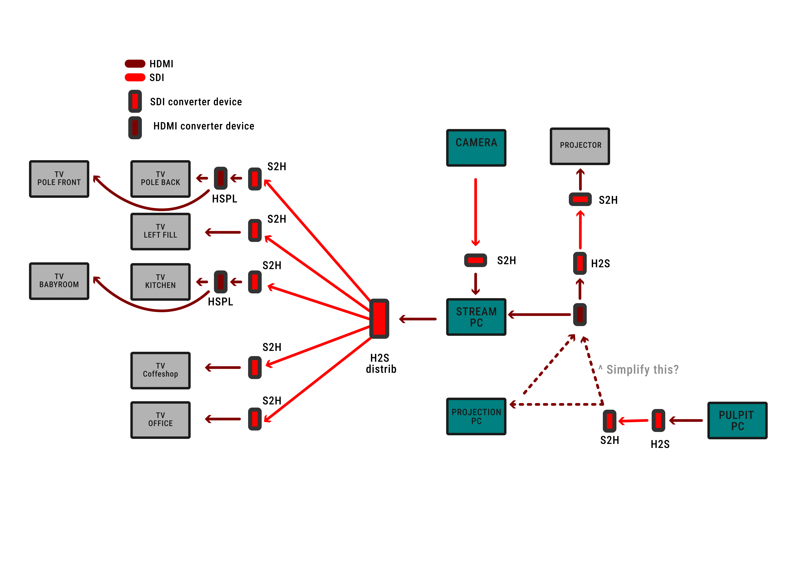

<h1>New video transmission plans</h1>

 * Planning sheet: [google drive](https://docs.google.com/spreadsheets/d/1_tC85iVudwEANW8VnUyTiWLb9mUJXwP3sWUcDPq6T24/edit?gid=0#gid=0)
 * Planning docs: [google drive](https://docs.google.com/document/d/155OE3GOrmQZAfHPzxElwVvQ6dSP-drkqUTD1z8VGsRk/edit?tab=t.0)
 * Measurement photos [google drive](https://drive.google.com/drive/folders/1WRx_DOEK6TJ4NNPws7wlNl8EEJPHr--F)

# Schematic

# Notes

Example latency from pc to output:
https://youtu.be/fHT2pqEMIBQ?si=r_CF3j0XQK49qyHf&t=940

5 frames @ 60fps => 83ms
