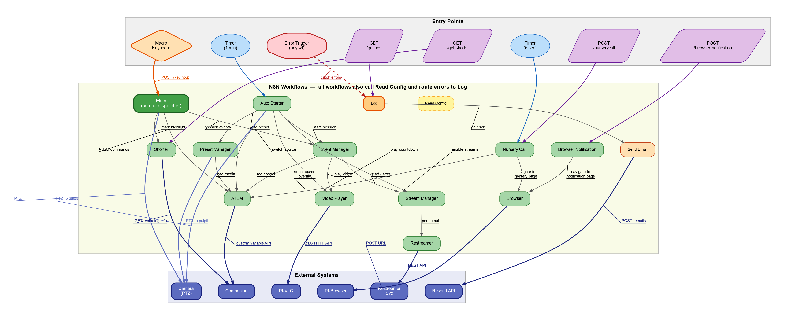

# Schematic

# Components
* [Macro Keyboard](keyboard)
* [Raspberry PI](rpi)
* [ATEM](atem)

* [Server configuration](server)

# Connection diagram

# Automation diagram
(Learn more in [n8n](server/n8n).)

# Service access

 * NAS: https://ccp-cy.myddns.me/cgi-bin/

The addresses below only work from the church network, or via special remote access.

 * N8N [http://192.168.2.5:3000](http://192.168.2.5:3000)
 * Companion [http://192.168.2.5:3001](http://192.168.2.5:3001)
 * Restreamer [http://192.168.2.5:3002/ui/#/7cc9f27e-9b99-41d8-ba7c-dcb9eb84b967](http://192.168.2.5:3002/ui/#/7cc9f27e-9b99-41d8-ba7c-dcb9eb84b967)
 * Various web services: https://192.168.2.10

## For basic remote management
* Multiview from the PI: http://192.168.2.200:8888/cam/
* Remote control keyboard: https://192.168.2.10/remote/
* ATEM IP: 192.168.2.201 (To be used in [Atem Software Control](https://www.blackmagicdesign.com/products/atemmini/software))
