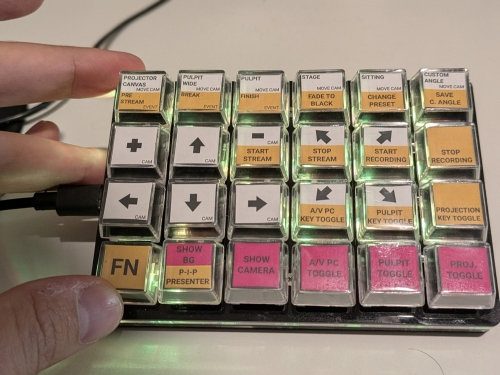
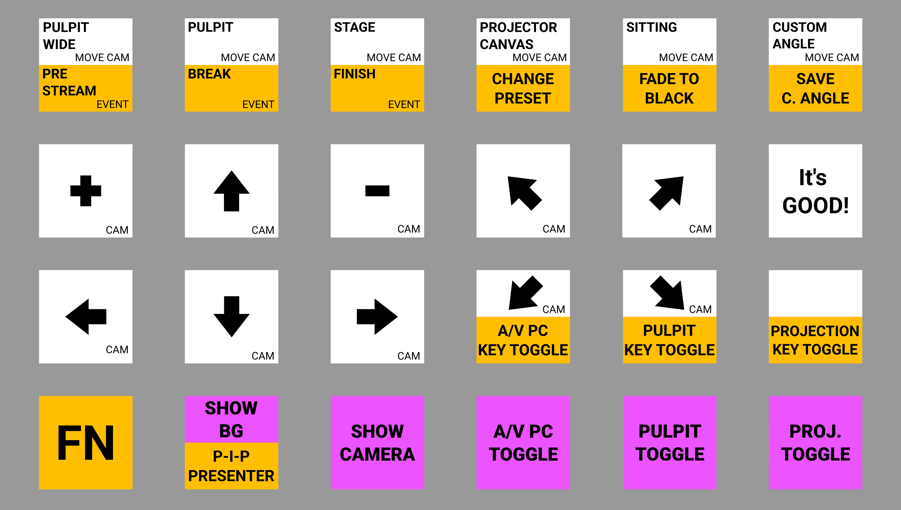

# Keyboard

 * [Sayo Device 24 keys macro keyboard](https://duckduckgo.com/?q=sayo+device+4x6+24keys+keyboard)

# Configuration
 * Most keys send ALT+SUPER(windows key)+`<some character>`, except FN that adds CTRL.
   * e.g.: ALT+META+f _recall custom angle_ CTRL+ALT+META+f (same button with FN) is _save custom angle_
 * These keyboards configurable at https://sayodevice.com (or https://github.com/Sayobot/SayoDevice_manual)

# Labels
  * [keycaplabels_6x4.svg](keycaplabels_6x4.svg)
  * [keycaplabels_6x4.png](keycaplabels_6x4.png)
  * [keycaplabels_6x4.pdf](keycaplabels_6x4.pdf)

# Hotkey config list
| Hotkey | Function | What Happens |                                                                                                                                                                                                                                                      
|---|---|---|                                                                                                                                                                                                                                                                           
| ALT+META+1 | CAM MOVE UP | PTZ camera moves up continuously (`ptzcmd&up`). Releasing the key sends stop command. |                                                                                                                                                                      
| ALT+META+2 | CAM MOVE DOWN | PTZ camera moves down continuously (`ptzcmd&down`). Releasing the key sends stop command. |
| ALT+META+3 | CAM MOVE LEFT | PTZ camera pans left continuously (`ptzcmd&left`). Releasing the key sends stop command. |                                                                                                                                                                 
| ALT+META+4 | CAM MOVE RIGHT | PTZ camera pans right continuously (`ptzcmd&right`). Releasing the key sends stop command. |                                                                                                                                                            
| ALT+META+q | CAM MOVE RIGHTUP | PTZ camera moves diagonally up-right (`ptzcmd&rightup`). Releasing stops. |                                                                                                                                                                           
| ALT+META+o | CAM MOVE LEFTUP | PTZ camera moves diagonally up-left (`ptzcmd&leftup`). Releasing stops. |
| ALT+META+v | CAM MOVE RIGHTDOWN | PTZ camera moves diagonally down-right (`ptzcmd&rightdown`). Releasing stops. |
| ALT+META+u | CAM MOVE LEFTDOWN | PTZ camera moves diagonally down-left (`ptzcmd&leftdown`). Releasing stops. |
| ALT+META+9 | CAM ZOOM IN | PTZ camera zooms in continuously (`ptzcmd&zoomin`). Releasing stops zoom. |
| ALT+META+a | CAM ZOOM OUT | PTZ camera zooms out continuously (`ptzcmd&zoomout`). Releasing stops zoom. |
| ALT+META+g | CAM RECALL PRESET PROJECTOR | Recalls PTZ camera preset slot 4 — projector view (`ptzcmd&poscall&4`). |
| ALT+META+c | CAM RECALL PRESET PULPIT WIDE | Recalls PTZ camera preset slot 2 — wide pulpit view (`ptzcmd&poscall&2`). |
| ALT+META+s | CAM RECALL PRESET STAGE | Recalls PTZ camera preset slot 1 — stage view (`ptzcmd&poscall&1`). |
| ALT+META+f | CAM RECALL PRESET CUSTOM CALL | Recalls PTZ camera preset slot 5 — previously saved custom position (`ptzcmd&poscall&5`). |
| ALT+META+t | CAM RECALL PRESET SITTING | Recalls PTZ camera preset slot 3 — sitting/closeup view (`ptzcmd&poscall&3`). |
| ALT+META+d | CAM RECALL PRESET PULPIT | Recalls PTZ camera preset slot 0 — default pulpit position (`ptzcmd&poscall&0`). |
| ALT+META+k | PROJECTION PC TOGGLE | Reads current key 2 state from DB, flips it, and toggles USK2 (Projection PC) on the ATEM switcher on-air. |
| ALT+META+l | PULPIT TOGGLE | Reads current key 3 state from DB, flips it, and toggles USK3 (Pulpit) on the ATEM switcher on-air. |
| ALT+META+m | A/V PC TOGGLE | Reads current key 4 state from DB, flips it, and toggles USK4 (A/V PC) on the ATEM switcher on-air. |
| ALT+META+x | SHOW BG | Switches ATEM program output to MPLAYER1 — shows the media player (background video/image). |
| ALT+META+y | SHOW CAM | Switches ATEM program output to CAM — brings camera live, unless program switching is locked. |
| ALT+META+p | IT'S GOOD | Calls the "shorter" workflow with the current timestamp — marks the moment as a good take for post-production. |
| CTRL+ALT+META+f | PRESET CUSTOM SAVE | Saves the current camera position as a custom preset via the preset manager workflow (higher-level than ALT+META+b). |
| CTRL+ALT+META+u | A/V PC KEY TOGGLE | Directly toggles the A/V PC key (USK4) state in the DB and updates ATEM, without first reading current state. |
| CTRL+ALT+META+v | PULPIT KEY TOGGLE | Directly toggles the Pulpit key (USK3) state in the DB and updates ATEM, without first reading current state. |
| CTRL+ALT+META+w | PROJECTION KEY TOGGLE | Directly toggles the Projection PC key (USK2) state in the DB and updates ATEM, without first reading current state. |
| CTRL+ALT+META+x | PIP PRESENTER | Toggles the presenter Picture-in-Picture overlay (USK4) on the ATEM program output. |
| CTRL+ALT+META+c | Event: pre stream mode | Calls the event manager with `do_prestream=1` — triggers the pre-stream sequence (e.g. intro video/graphics). |
| CTRL+ALT+META+d | Event: break | Calls the event manager with `do_break=1` — triggers the break sequence (e.g. shows break screen). |
| CTRL+ALT+META+s | Event: finish | Calls the event manager with `do_finish=1` — triggers the finish sequence (ends stream/recording, shows end screen). |
| CTRL+ALT+META+t | Fade to Black Toggle | Calls the ATEM workflow with `toggle_black=1` — toggles ATEM's fade-to-black on/off. |
| CTRL+ALT+META+g | Change PRESET | Reads current preset from DB, calculates the next preset in sequence, and calls the preset manager to advance to it. |

